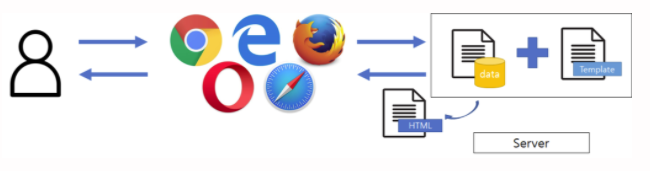
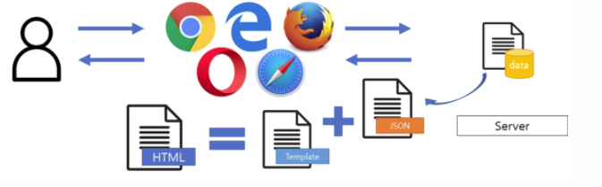

# 서버 템플릿 엔진과 머스테치 소개

템플릿 엔진이란?

- 지정된 템플릿 양식과 데이터가 합쳐져 HTML 문서를 출력하는 소프트웨어입니ㅏㄷ.
- 다른 템플릿 엔진 : JSP, 리액트, 뷰 등

JSP, Thymeleaf와 같은 서버 템플릿 엔진은 서버에서 자바 코드로 문자열을 만든뒤 이 문자열을 html로 변환하여 브라우저로 전달합니다.
자바스크립트 코드는 브라우저 위에서 작동됩니다.

클라이언트 템플릿 엔진은 서버는 Json 혹은 Xml 형식의 데이터만 전달하고 클라이언트에서 조립하는 방식입니다.

## 머스테치란

- 서버 / 클라이언트 템플릿 엔진
- 수많은 언어를 지원하는 가장 심플한 템플릿 엔진
- 루비, 자바스크립트, 파이썬, PHP, 자바, 펄, GO, ASP 등
- 자바에서 사용할때는 서버 템플릿 엔진으로, 자바스크립트에서 사용할때는 클라이언트 템플릿 엔진으로 사용할 수 있습니다.

### 템플릿 엔진들의 단점

- JSP, Velocity : 스프링 부트에서는 관장하지 않는 템플릿 엔진
- Freemarker : 템플릿 엔진으로는 과하게 많은 기능을 제공합니다. 높은 자유도로 인해 Freemarker 안에 비즈니스 로직이 추가될 확률이 높습니ㅏㄷ.
- Thymeleaf : 스프링 진영에서 적극적으로 밀고 있지만 문법이 어렵습니다.

### 머스테치 장점

- 문법이 다른 템플릿 엔진보다 심플합니다.
- 로직 코드를 사용할 수 없어 View 역할과 서버의 역할이 명확하게 분리됩니다.
- Mustache.js와 Mustache.java 2가지 다있어서 하나의 문법으로 클라이언트/서버 템플릿을 모두 사용 가능합니다.
