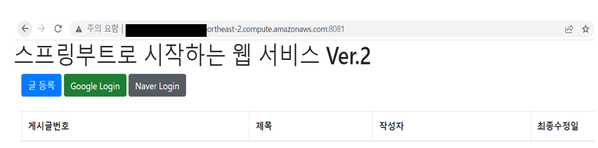

## EC2에 프로젝트 Clone 받기

1. git 설치

```shell
$ sudo yum install git
```

2. 프로젝트를 저장할 디렉토리 생성

```shell
$ mkdir ~/app
$ cd ~/app
```

3. github 저장소에 있는 저장소 주소 복사하여 clone 수행

```shell
app $ git clone https://github.com/yonghwankim-dev/freelec-springboot2-webservice.git
```

4. 프로젝트 테스트가 잘되는지 확인

```shell
$ ./gradlew test
```

만약 gradlew이 실행권한이 없다면 chmod 명령어를 이용하여 실행권한을 줄수 있습니다.

```shell
$ chmod +x ./gradlew
```

## 배포 스크립트 만들기

1. 다음과 같이 deploy.sh 파일을 생성하고 파일 내용에 다음과 같이 작성합니다.

```shell
#!/bin/bash

REPOSITORY=$(cd .. && pwd)
PROJECT_NAME=freelec-springboot2-webservice

cd $REPOSITORY/$PROJECT_NAME/

echo "> Git Pull"

git pull

echo "> 프로젝트 Build 시작"

chmod +x ./gradlew

./gradlew build

echo "> 디렉토리로 이동"

cd $REPOSITORY

echo "> Build 파일 복사"

cp $REPOSITORY/$PROJECT_NAME/build/libs/*.jar $REPOSITORY/

echo "> 현재 구동중인 애플리케이션 pid 확인"

CURRENT_PID=$(pgrep -f ${PROJECT_NAME}.*.jar)

echo "현재 구동 중인 애플리케이션 pid: $CURRENT_PID"

if [ -z "$CURRENT_PID"]; then
  echo "> 현재 구동 중인 애플리케이션이 없으므로 종료하지 않습니다."
else
  echo "> kill -15 $CURRENT_PID"
  kill -15 $CURRENT_PID
  sleep 5
fi

echo "> 새 애플리케이션 배포"

JAR_NAME=$(ls -tr $REPOSITORY/ | grep jar | tail -n 1)

echo "> JAR Name: $JAR_NAME"

nohup java -jar -Dspring.config.location=classpath:/application.properties,$REPOSITORY/application-oauth.properties,$REPOSITORY/application-real-db.properties,classpath:/application-real.properties -Dspring.profiles.active=real -Dserver.port=8081 $REPOSITORY/$JAR_NAME 2>&1 &

```

2. deploy.sh 파일에 실행권한 부여

```shell
$ chmod +x ./deploy.sh
```

## 외부 Security 파일 등록하기

1. app 디렉토리에 application-oauth.properties 파일 작성

```shell
spring.security.oauth2.client.registration.google.client-id={구글 클라이언트 아이디}
spring.security.oauth2.client.registration.google.client-secret={구글 클라이언트-시크릿 키}
spring.security.oauth2.client.registration.google.scope=profile,email
spring.security.oauth2.client.registration.naver.client-id={네이버 클라이언트 아이디}
spring.security.oauth2.client.registration.naver.client-secret={네이버 클라이언트-시크릿 키}
spring.security.oauth2.client.registration.naver.redirect-uri={리다이렉트 URI}
spring.security.oauth2.client.registration.naver.authorization-grant-type=authorization_code
spring.security.oauth2.client.registration.naver.scope={네이버 스코프}
spring.security.oauth2.client.registration.naver.client-name=Naver
spring.security.oauth2.client.provider.naver.authorization-uri={인증-URI}
spring.security.oauth2.client.provider.naver.token-uri={네이버 토큰 URI}
spring.security.oauth2.client.provider.naver.user-info-uri={네이버 사용자 정보 URI}
spring.security.oauth2.client.provider.naver.user-name-attribute=response
```

## 스프링부트 프로젝트로 RDS 접근하기

RDS는 MariaDB를 사용 중입니다. 스프링부트 프로젝트를 실행하기 위해서는 다음과 같은 작업이 필요합니다.

- 테이블 생성
- 프로젝트 설정
- EC2 설정

1. 테이블 생성
   테스트 코드 수행시 로그로 생성되는 쿼리를 테이블 생성 쿼리로써 사용합니다.

```shell
create table posts (id bigint not null auto_increment, created_date datetime, modified_date datetime, author varchar(255), content TEXT not null, title varchar(500) not null, primary key (id)) engine=InnoDB
create table users (id bigint not null auto_increment, created_date datetime, modified_date datetime, email varchar(255) not null, name varchar(255) not null, picture varchar(255), role varchar(255) not null, primary key (id)) engine=InnoDB
```

2. 스프링 세션 테이블 생성
   schema-mysql.sql 로그 파일에서 확인하여 다음과 같이 생성합니다.

```shell
CREATE TABLE SPRING_SESSION (
	PRIMARY_ID CHAR(36) NOT NULL,
	SESSION_ID CHAR(36) NOT NULL,
	CREATION_TIME BIGINT NOT NULL,
	LAST_ACCESS_TIME BIGINT NOT NULL,
	MAX_INACTIVE_INTERVAL INT NOT NULL,
	EXPIRY_TIME BIGINT NOT NULL,
	PRINCIPAL_NAME VARCHAR(100),
	CONSTRAINT SPRING_SESSION_PK PRIMARY KEY (PRIMARY_ID)
) ENGINE=InnoDB ROW_FORMAT=DYNAMIC;

CREATE UNIQUE INDEX SPRING_SESSION_IX1 ON SPRING_SESSION (SESSION_ID);
CREATE INDEX SPRING_SESSION_IX2 ON SPRING_SESSION (EXPIRY_TIME);
CREATE INDEX SPRING_SESSION_IX3 ON SPRING_SESSION (PRINCIPAL_NAME);

CREATE TABLE SPRING_SESSION_ATTRIBUTES (
	SESSION_PRIMARY_ID CHAR(36) NOT NULL,
	ATTRIBUTE_NAME VARCHAR(200) NOT NULL,
	ATTRIBUTE_BYTES BLOB NOT NULL,
	CONSTRAINT SPRING_SESSION_ATTRIBUTES_PK PRIMARY KEY (SESSION_PRIMARY_ID, ATTRIBUTE_NAME),
	CONSTRAINT SPRING_SESSION_ATTRIBUTES_FK FOREIGN KEY (SESSION_PRIMARY_ID) REFERENCES SPRING_SESSION(PRIMARY_ID) ON DELETE CASCADE
) ENGINE=InnoDB ROW_FORMAT=DYNAMIC;

```

3. 프로젝트 설정
   MariaDB 드라이버를 build.gradle에 등록합니다.

```shell
implementation 'org.mariadb.jdbc:mariadb-java-client'
```

src/main/resources/application-real.properties 파일을 추가하여 프로파일이 real인 환경에서

설정할 속성을 구성합니다.

```shell
spring.profiles.include=oauth,real-db
spring.jpa.properties.hibernate.dialect=org.hibernate.dialect.MySQL5InnoDBDialect
spring.session.store-type=jdbc
```

- 프로파일 환경으로 applicatoin-oauth.properties, application-real-db.properties를 추가합니다.

4. EC2 설정
   app 디렉토리에 application-real-db.properties 파일을 생성합니다.

```shell
$ vim ~/app/applicatoin-real-db.properties 
```

```shell
spring.jpa.hibernate.ddl-auto=none
spring.datasource.url=jdbc:mariadb://{RDS 엔드포인트 주소}
spring.datasource.username={데이터베이스 사용자 이름}
spring.datasource.password={데이터베이스 사용자 비밀번호}
spring.datasource.driver-class-name=org.mariadb.jdbc.Driver

```

5. 실행 결과 확인
```shell
curl localhost:8081
```
위 실행결과로 HTML 코드가 나오면 성공입니다.

## EC2에서 소셜 로그인하기
1. AWS 보안 그룹 변경
EC2 인스턴스의 보안 그룹에서 TCP 8081 포트가 열려있는지 확인하고 없다면 추가합니다.


2. AWS EC2 도메인 확인 및 접속하기
인스턴스 -> 상세 정보 들어가기 -> 퍼블릭 IPv4 DNS 확인




3. 구글에 EC2 주소 등록
구글 클라우드 접속 -> API 및 서비스 -> 사용자 인증 정보 -> OAuth 동의 확인 -> 수정 -> 승인된 도메인에 

EC2 인스턴스의 도메인 주소를 넣습니다.


사용자 인증 정보 -> 본인이 등록한 서비스 이름 클릭 -> 승인된 리다이렉션 URI에 퍼블릭 DNS 주소에 :8081/login/oauth2/code/google 주소를

추가하여 승인된 리다이렉션 URI에 등록합니다.


4. 네이버에 EC2 주소 등록
네이버 API 접속 -> 내 애플리케이션 -> 본인 프로젝트 선택 -> API 설정 탭 -> 서비스 URL과 Callback URI 2개를 수정합니다.


8081 포트를 제외하고 실제 도메인 주소만 입력합니다.


