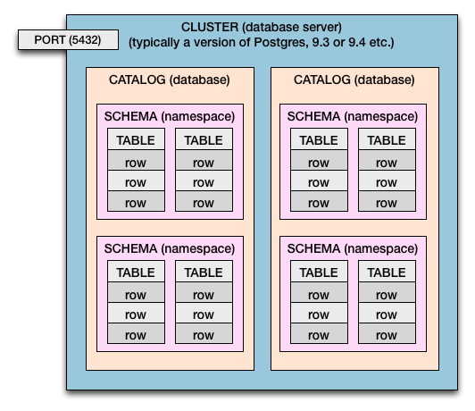

# 4장 엔티티 매핑

## 목차

- 매핑 애노테이션 지원
- @Entity
- @Table
- 데이터베이스 스키마 자동 생성
- DDL 생성 기능
- 기본 키 매핑
- 필드와 컬럼 매핑: 레퍼런스

## 매핑 애노테이션 지원

- 객체와 테이블 매핑 : @Entity, @Table
- 기본 키 매핑 : @Id
- 필드와 컬럼 매핑 : @Column
- 연관관계 매핑 : @ManyToOne, @JoinColumn

## @Entity

- @Entity : @Entity가 붙은 클래스는 JPA가 관리하게 되는 클래스
- @Entity 특징
    - 기본 생성자는 필수
    - final 클래스, enum, interface, inner 클래스에는 사용할 수 없습니다.
    - 저장할 필드에 final을 사용하면 안됩니다.

```java

@Entity
public class Member {

}
```

## @Table

- @Table : 엔티티와 매핑할 테이블을 직접 지정합니다. 생략시 매핑한 엔티티의 이름을 테이블 이름으로 설정합니다.
- 예를 들어 엔티티 클래스 이름이 Member라면 테이블 이름은 MEMBER가 됩니다.

### @Table 속성 정리

| 속성                     | 기능                                      | 기본값       |
|------------------------|-----------------------------------------|-----------|
| name                   | 매핑할 테이블 이름                              | 엔티티 이름 사용 |
| catalog                | catalog 기능이 있는 데이터베이스에서 catalog를 매핑합니다. |           |
| schma                  | schema 기능이 있는 데이터베이스에서 schema를 매핑합니다.   |           |
| uniqueConstraints(DDL) | DDL 생성 시에 유니크 제약조건을 만듭니다.               |           |

### 데이터베이스 그룹



### @Table 예시

```java

@Entity
@Table(name = "MEMBER", uniqueConstraints = {
    @UniqueConstraint(name = "NAME_AGE_UNIQUE", columnNames = {"NAME", "AGE"})})
public class Member {
    //...
}
```

## 데이터베이스 스키마 자동 생성

persistence.xml 파일에 스키마 자동 생성 기능을 명시합니다.

```xml
<!-- 애플리케이션 실행 시점에 데이터베이스 테이블 자동 생성 -->
<property name="hibernate.hbm2ddl.auto" value="create"/>
```

콘솔에 실행되는 테이블 생성 DDL 출력 설정

```xml
<!-- 콘솔에 하이버네이트가 실행하는 SQL문 출력 -->
<property name="hibernate.show_sql" value="true"/>
```

데이터베이스 스키자 자동 생성 실행 결과

```
Hibernate: 
    create table MEMBER (
       ID varchar(255) not null,
        AGE integer,
        CREATE_DATE timestamp,
        description clob,
        LAST_MODIFIED_DATE timestamp,
        ROLE_TYPE varchar(255),
        NAME varchar(10) not null,
        primary key (ID)
    )
```

### hibernate.hbm2ddl.auto 속성

| 옵션          | 설명                                                                                   |
|-------------|--------------------------------------------------------------------------------------|
| create      | 기존 테이블을 삭제하고 새로 생성합니다. (DROP + CREATE)                                               |
| create-drop | create 속성에 추가로 애플리케이션을 종료할 때 생성한 DDL을 제거합니다. (DROP + CREATE + DROP)                  |
| update      | 데이터베이스 테이블과 엔티티 매핑정보를 비교해서 변경 사항만 수정한다.                                              |
| validate    | 데이터베이스 테이블과 엔티티 매핑 정보를 비교해서 차이가 있으면 경고를 남기고 애플리케이션을 실행하지 않습는다. 이 설정은 DDL을 수정하지 않습니다. |
| none        | 자동 생성 기능을 사용하지 않습니다.                                                                 |

#### HBM2DDL 주의사항

- 운영 서버에서 create, creat-drop, update 처럼 DDL을 수정하는 옵션은 절대 사용하면 안됩니다.
- 개발 환경에 따른 추천 전략
    - 개발 초기 단계 : create, update
    - 초기화 상태로 자동화된 테스트를 진행하는 개발자 환경과 CI 서버 : create, create-drop
    - 테스트 서버 : update, validate
    - 스테이징과 운영 서버 : validate, none

#### 이름 매핑 전략 변경하기

- 단어와 단어를 구분할때 자바는 관례상 roleType과 같이 **카멜 표기법**을 주로 사용하고
  데이터베이스는 관례상 role_type과 같이 **언더스코어(_)** 를 주로 사용합니다.

hibernate.ejb.naming_strategy 속성을 사용하면 이름 매핑 전략을 변경할 수 있습니다.

```xml
<!-- 이름 매핑 전략 설정 - 자바의 카멜 표기법을 테이블의 언더스코어 표기법으로 매핑
ex) lastModifiedDate -> last_modified_date -->
<property name="hibernate.ejb.naming_strategy"
  value="org.hibernate.cfg.ImprovedNamingStrategy"/>
```

```sql
create table MEMBER
(
    ID                 varchar(255) not null,
    AGE                integer,
    CREATE_DATE        timestamp,
    description clob,
    LAST_MODIFIED_DATE timestamp,
    ROLE_TYPE          varchar(255),
    NAME               varchar(10)  not null,
    primary key (ID)
)
```

위 생성된 테이블의 결과와 같이 roleType은 ROLE_TYPE이 되고, lastModifiedDate는 LAST_MODIFIED_DATE가 되는 것을 확인할 수 있습니다.

## DDL 생성 기능

### 컬럼에 제약 조건 추가

```java
public class Member {

    @Column(name = "NAME", nullable = false, length = 10)
    private String username;
    // ...
}
```

- nullable : 컬럼 데이터 값이 안들어갈 수 있는지 여부, false이면 무조건 데이터를 넣어야 합니다.
- length : 컬럼 데이터 길이

### 유니크 제약 조건 추가

```java

@Entity
@Table(name = "MEMBER", uniqueConstraints = {
    @UniqueConstraint(name = "NAME_AGE_UNIQUE", columnNames = {"NAME", "AGE"})})
public class Member {

    @Id
    @Column(name = "ID")
    private String id;

    @Column(name = "NAME", nullable = false, length = 10)
    private String username;
    // ...
}
```

- @UniqueConstraint : 유니크 제약 조건 설정 애노테이션
    - name : 제약조건명
    - columNames : 제약조건을 설정할 컬럼명들

```sql
alter table MEMBER
    add constraint NAME_AGE_UNIQUE unique (NAME, AGE)
```

## 기본 키 매핑

### 기본키 생성 전략

- 직접 할당 : 기본 키를 애플리케이션에서 직접 할당합니다.
- 자동 생성 : 대맄 키 사용 방식
    - IDENTITY : 기본 키 생성을 데이터베이스에 위임합니다.
    - SEQUENCE : 데이터베이스 시퀀스를 사용해서 기본 키를 할당합니다.
    - TABLE : 키 생성 테이블을 사용합니다.

#### IDENTITY

- 데이터베이스에서 자동 증가(Auto-increment) 기능을 활용하여 기본키 값을 생성하는 방식입니다.
- JPA는 데이터베이스에 INSERT 쿼리를 실행하고나서 생성된 기본키 값을 다시 읽어와서 엔티티에 할당합니다.
- MySQL, PostgreSQL 등

#### SEQUENCE

- 데이터베이스에서 제공하는 **시퀀스(Sequence) 객체를 사용하여 기본키 값을 생성**하는 방식입니다.
- 시퀀스 : 일련번호를 생성하는 데이터베이스 객체
- JPA는 시퀀스에서 다음 값을 가져와서 엔티티에 할당하고 그 후에 INSERT 쿼리를 실행하여 데이터베이스에 저장합니다.
- Oracle, DB2, PostgreSQL, H2 등

#### 키 생성 전략 설정

```xml
<!-- JPA 표준에 맞춘 새로운 키 생성 전략 사용 -->
<property name="hibernate.id.new_generator_mappings" value="true"/>
```

### 기본 키 직접 할당 전략

```
    @Id
    @Column(name = "ID")
    private String id;
```

- 기본키를 직접 할당하려면 @Id로 매핑하면 됩니다.
- @Id 적용 가능한 자바 타입
    - 자바 기본형(int, double, ...)
    - 자바 래퍼형
    - String
    - java.util.Date
    - java.sql.Date
    - java.math.BigDecimal
    - java.math.BigInteger

기본 키 직접 할당 전략은 em.persist()로 엔티티를 지정하기 전에 애플리케이션에서 기본키를 직접 할당하는 전략입니다.

```
Board board = new Board();
board.setId("id1");
em.persist(board);
```

### IDENTITY 전략

IDENTITY는 기본 키 생성을 데이터베이스에 위임하는 전략입니다.

예를 들어 MySQL의 AUTO_INCREMENT 기능은 데이터베이스가 기본 키를 자동으로 생성해줍니다.

다음 SQL문은 MYSQL의 AUTO_INCREMENT 기능을 수행하는 SQL문입니다.

```sql
CREATE TABLE BOARD
(
    ID   INT NOT NULL AUTO_INCREMENT PRIMARY KEY,
    DATA VARCHAR(255)
);

INSERT INTO BOARD(DATA)
VALUES ('A');
INSERT INTO BOARD(DATA)
VALUES ('B');
```

- 테이블 생성 시 기본 키 컬럼인 ID에 AUTO_INCREMENT를 추가하였습니다.
- 데이터베이스에 값을 저장할 때 ID 컬럼을 비워두면 데이터베이스가 순서대로 값을 채워줍니다.

```java

@Entity
public class Board {

    @Id
    @GeneratedValue(strategy = GenerationType.IDENTITY)
    private Long id;
}
```

### SEQUENCE 전략

데이터베이스의 시퀀스는 유일한 값을 순서대로 생성하는 특별한 데이터베이스 객체입니다.

SEQUENCE 전략은 **시퀀스 객체를 사용해서 기본 키를 생성하는 전략**입니다.

다음 SQL문은 테이블과 테이블에 따른 기본 키를 생성하는 시퀀스 객체를 생성하는 SQL문입니다.

```sql
CREATE TABLE BOARD
(
    ID   BIGINT NOT NULL PRIMARY KEY,
    DATA VARCHAR(255)
);

# 시퀀스 객체 생성
CREATE
SEQUENCE BOARD_SEQ START
WITH 1 INCREMENT BY 1; 
```

위 테이블과 시퀀스 객체 생성에 대한 매핑 코드는 다음과 같습니다.

```java

@Entity
@SequenceGenerator(
    name = "BOARD_SEQUENCES_SEQ_GENERATOR",
    sequenceName = "BOARD_SEQ", // 매핑할 데이터베이스 시퀀스 이름
    initialValue = 1, allocationSize = 50
)
public class Board {

    @Id
    @GeneratedValue(strategy = GenerationType.TABLE, generator = "BOARD_SEQ_GENERATOR")
    private Long id;
}
```

- @SequenceGenerator : 시퀀스 객체 생성
    - name : 자바에서 구분하는 @SequenceGenerator 이름
    - sequenceName : 데이터베이스에 저장하는 시퀀스 객체 이름
    - initialValue : 시퀀스 초기 값
    - allocationSize : 시퀀스 한번 호출에 증가하는 수(성능 최적화에 사용됨), 기본값 = 50

#### SEQUENCE 전략과 최적화

SEQUENCE 전략은 데이터베이스 시퀀스를 통해 식별자를 조회하는 추가작업이 필요합니다.

1. 식별자를 구하려고 데이터베이스 시퀀스를 조회한다.
    - ex) SELECT BOARD_SEQ.NEXTVAL FROM DUAL
2. 조회한 시퀀스를 기본 키 값으로 사용하여 데이터베이스에 저장합니다.
    - ex) INSERT INTO BOARD...

- JPA는 시퀀스에 접근하는 횟수를 줄이기 위해 @SequenceGenerator.allocationSize를 사용합니다.
- 한번에 시퀀스 값을 증가시키고나서 그만큼 메모리에 시퀀스 값을 할당합니다.
- 예를 들어 allocationSize=50이면 시퀀스를 한번에 50 증가시킨 다음에 1~50까지는 메모리에서 식별자를 할당합니다.
- 시퀀스 값을 선점하여 여러 JVM이 동시에 동작해도 기본 키값이 충돌하지 않는 장점이 있습니다.

### TABLE 전략

TABLE 전략은 **키 생성 전용 테이블을 하나 만들고 여기에 이름과 값**으로 사용할 컬럼을 만들어 데이터베이스 시퀀스를 흉내내는 전략입니다.

TABLE 전략은 모든 데이터베이스에 적용될 수 있습니다.

TABLE 전략 키 생성 DDL

```sql
create table MY_SEQUENCES
(
    sequence_name varchar(255) not null,
    next_val      bigint,
    primary key (sequence_name)
)
```

- sequence_name 컬럼을 시퀀스 이름으로 사용하고 next_val 컬럼을 시퀀스 값으로 사용합니다.

TABLE 전략 매핑 코드

```java

@Entity
@TableGenerator(
    name = "BOARD_SEQ_GENERATOR",
    table = "MY_SEQUENCES",
    pkColumnValue = "BOARD_SEQ", allocationSize = 50
)
public class Board {

    @Id
    @GeneratedValue(strategy = GenerationType.TABLE, generator = "BOARD_SEQ_GENERATOR")
    private Long id;
}
```

MY_SEQUENCES 결과 테이블

| sequence_name | next_val |
|---------------|----------|
| BOARD_SEQ     | 2        |
| MEMBER_SEQ    | 10       |
| PRODUCT_SEQ   | 50       |

#### @TableGenerator

| 속성                     | 기능                        | 기본값                 |
|------------------------|---------------------------|---------------------|
| name                   | 식별장 생성기 이름                | 필수                  |
| table                  | 키 생성 테이블명                 | hibernate_sequences |
| pkColumnName           | 시퀀스 컬럼명                   | sequence_name       |
| valueColumnName        | 시퀀스 값 컬럼명                 | next_val            |
| pkColumnValue          | 키로 사용할 값 이름               | 엔티티 이름              |
| initialValue           | 초기값, 마지막으로 생성된 값이 기준입니다.  | 0                   |
| allocationSize         | 시퀀스 하번 호출에 증가하는수          | 50                  |
| catalog, schema        | 데이터베이스 catalog, schmea 이름 |                     |
| uniqueConstraints(DDL) | 유니크 제약 조건 지정              |                     |

### AUTO 전략

AUTO 전략은 데이터베이스 방언에 따라 IDENTITY, SEQUENCE, TABLE 전략 중 하나를 자동으로 선택하는 전략입니다.

AUTO 전략 매핑 코드

```java

@Entity
public class Board {

    @Id
    @GeneratedValue(strategy = GenerationType.AUTO)
    private Long id;
}
```

## 필드와 컬럼 매핑: 레퍼런스

| 분류        | 매핑 어노테이션    | 설명                      |
|-----------|-------------|-------------------------|
| 필드와 컬럼 매핑 | @Column     | 컬럼을 매핑한다                |
|           | @Enumerated | enum 타입을 매핑한다           |
|           | @Temporal   | 날씨 타입을 매핑한다             |
|           | @Lob        | BLOB, CLOB 타입을 매핑한다     |
|           | @Transient  | 특정 필드를 데이터베이스에 매핑하지 않는다 |
| 기타        | @Access     | JPA가 엔티티에 접근하는 방식을 지정한다 |


