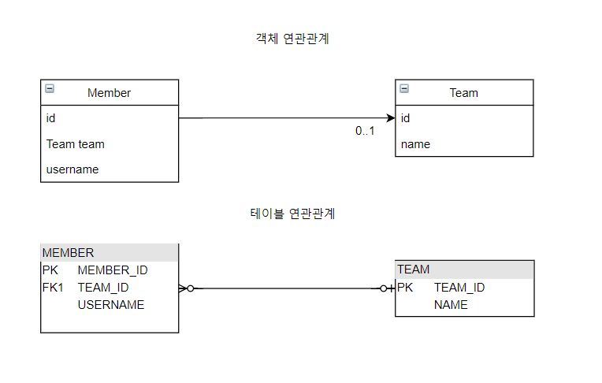

# 5장 연관관계 매핑 기초

## 목차

- 단방향 연관관계
- 연관관계 사용
- 양방향 연관관계
- 연관관계의 주인
- 양방향 연관관계 저장
- 양방향 연관관계의 주의점

## 단방향 연관관계

회원(Member)과 팀(Team)의 다대일 단반향 관계는 다음과 같습니다.

- 회원과 팀이 있다.
- 회원은 하나의 팀에만 소속될 수 있다.
- 회원과 팀은 다대일 관계이다.



**객체 연관관계**

- 회원 객체는 Member.team 필드로 팀 객체와 연관관계를 맺습니다.
- 회원 객체와 팀 객체는 단방향 관계입니다. 회원 객체는 팀 객체를 참조할 수 있지만, 팀 객체는 회원 객체를 참조할 수 없습니다.

**테이블 연관관계**

- 회원 테이블은 TEAM_ID 외래 키로 팀 테이블과 연관관계를 맺습니다.
- 회원 테이블과 팀 테이블은 양방향 관계입니다. 회원 테이블 또는 팀 테이블의 TEAM_ID 키를 통하여 조인하여 서로를 참조할 수 있습니다.

```
SELECT *
FROM MEMBER M 
JOIN TEAM T ON M.TEAM_ID = T.TEAM_ID

OR

SELECT *
FROM TEAM T
JOIN MEMBER M ON T.TEAM_ID = M.TEAM_ID
```

**객체 연관관계와 테이블 연관관계의 가장 큰 차이**

- 객체간의 양방향 관계로 만들고 싶다면 각 객체간에 서로 관계를 맺은 객체를 참조할 수 있도록 해야한다.
  즉, 서로 다른 단방향 2개를 놓은 것과 같은 효과이다.
- 테이블 연관관계에서는 외래 키 하나로 양방향으로 조인할 수 있습니다.

```
객체 연관관계 단방향
class A{
    B b;
}

class B{
}

객체 연관관계 양방향
class A{
    B b;
}

class B{
    A a;
} 
```

**객체 연관관계 vs 테이블 연관관계 정리**

- 객체는 참조(주소)로 연관관계를 맺습니다.
- 테이블은 외래 키로 연관관계를 맺습니다.
- 참조를 사용하는 객체의 연관관계는 단방향입니다.
    - A -> B (a.b)
- 외래 키를 사용하는 테이블의 연관관계는 양방향입니다.
    - A JOIN B가 가능하면 반대로 B JOIN A도 가능합니다.
- 객체를 양방향으로 참조하려면 단방향 연관관계를 2개로 만들어야 합니다.
    - A -> B (a.b)
    - B -> A (b.a)

### 순수한 객체 연관관계

다음 예제는 JPA를 사용하지 않은 순수한 회원과 팀 객체간의 연관관계를 나타낸 코드입니다.

```java
public class Member {

    private String id;
    private String username;

    private Team team; // 팀의 참조를 보관

    public void setTeam(Team team) {
        this.team = team;
    }

    // Getter, Setter...
}

public class Team {

    private String id;
    private String name;

    // Getter, Setter...
}

```

- 위 예제에서 Member 클래스의 team 필드 멤버는 Team 객체를 참조하고 있습니다.
- 팀 객체는 값이 있거나 없을 수 있습니다.

테스트 코드는 다음과 같습니다.

```java
class MemberTest {

    @Test
    @DisplayName("회원1과 회원2, 팀1이 주어지고 회원들이 팀에 소속될때 회원은 팀을 참조할 수 있다")
    public void test1() {
        // given
        Member member1 = new Member();
        member1.setId("member1");
        member1.setUsername("회원1");

        Member member2 = new Member();
        member2.setId("member2");
        member2.setUsername("회원2");

        Team team1 = new Team();
        team1.setId("team1");
        team1.setName("팀1");
        // when
        member1.setTeam(team1);
        member2.setTeam(team1);
        Team findTeam = member1.getTeam();
        // then
        Assertions.assertThat(findTeam.getId()).isEqualTo(team1.getId());
    }
}
```

- 회원1과 회원2는 같은 팀 team1을 참조하고 있습니다.
- 팀 객체는 회원1과 회원2를 참조할 수 없습니다.

### 테이블 연관관계

데이터베이스에서 테이블의 회원과 팀의 관계를 살펴보면 다음과 같습니다.

회원과 팀 테이블의 DDL은 다음과 같습니다.

```
create table Member
(
    MEMBER_ID varchar(255) not null,
    username  varchar(255),
    TEAM_ID   varchar(255),
    primary key (MEMBER_ID)
)

create table Team
(
    TEAM_ID varchar(255) not null,
    name    varchar(255),
    primary key (TEAM_ID)
)

alter table Member
    add constraint FKl7wsny760hjy6x19kqnduasbm
        foreign key (TEAM_ID)
            references Team
```

위 테이블을 기반으로 회원1과 회원2를 팀1에 소속시키는 sql 코드는 다음과 같습니다.

```
insert into team(TEAM_ID, name)
values ('team1', '팀1');
insert into member(MEMBER_ID, TEAM_ID, USERNAME)
values ('member1', 'team1', '김용환');
insert into member(MEMBER_ID, TEAM_ID, USERNAME)
values ('member2', 'team1', '홍길동');
```

회원1이 소속된 팀을 다음과 같이 조회할 수 있습니다.

```
select T.*
from member M
         join team T on M.team_id = T.team_id
where M.member_id = 'member1';
```

- 데이터베이스는 외래 키(team_id)를 사용해서 연관관계를 탐색할 수 있는데 이것을 조인이라고 합니다.

### 객체 관계 매핑

Member 클래스와 Team 클래스에 JPA를 적용하여 객체 관계 매핑을 수행합니다.

```java

@Entity
public class Member {
    // ...

    @ManyToOne
    @JoinColumn(name = "TEAM_ID")
    private Team team;

    // 연관관계 설정
    public void setTeam(Team team) {
        this.team = team;
    }
}

@Entity
public class Team {

    @Id
    @Column(name = "TEAM_ID")
    private String id;
}
```

- 연관관계 매핑 : Member.team과 MEMBER.TEAM_ID를 매핑하는 것

```
@ManyToOne
@JoinColumn(name = "TEAM_ID")
private Team team;
```

- @ManyToOne : 다대일 관계라는 매핑 정보입니다. 회원과 팀이 다대일 관계이기 때문에 명시합니다.
- @JoinColumn(name = "TEAM_ID") : 조인 컬럼은 외래 키를 매핑할 때 사용합니다.
  name 속성에는 매핑할 외래 키 이름을 지정합니다.

### @JoinColumn

다음은 @JoinColumn의 속성입니다.

| 속성                                                               | 기능                                              | 기본값                     |
|------------------------------------------------------------------|-------------------------------------------------|-------------------------|
| name                                                             | 매핑할 외래 키 이름                                     | 필드명+_+참조하는 테이블의 기본키 컬럼명 |
| referencedColumnName                                             | 외래 키가 참조하는 대상 테이블의 컬럼명                          | 참조하는 테이블의 기본키 컬럼명       |
| foreignKey(DDL)                                                  | 외래 키 제약조건을 직접 지정할 수 있다. 이 속성은 테이블을 생성할때만 사용합니다. |                         |
| unique, nullable, insertable, updatable, columnDefinition, table | @Column의 속성과 동일합니다.                             |                         |

### @ManyToOne

다음은 @ManyToOne의 속성입니다.

| 속성           | 기능                                                                       | 기본값                                                      |
|--------------|--------------------------------------------------------------------------|----------------------------------------------------------|
| optional     | false로 설정하면 연관된 엔티티가 항상 있어야합니다.                                          | true                                                     |
| fetch        | 글로벌 페치 전략을 설정합니다.                                                        | @ManyToOne=FetchType.EAGER<br/>@OneToMany=FetchType.LAZY |
| cascade      | 영속성 전이 기능을 사용합니다.                                                        |                                                          |
| targetEntity | 연관된 엔티티의 타입 정보를 설정합니다. 이 기능은 거의 사용하지 않는다. 컬렉션을 사용해도 제너릭으로 타입 정보를 할 수 있다. |                                                          |

```
@OneToMany
private List<Member> members; // 제너릭으로 타입 정보를 알 수 있습니다.

@OneToMany(targetEntity=Member.class)
private List members; // 제네릭이 없으면 타입 정보를 알 수 없다.
```

## 연관관계 사용

### 저장

```
member1.setTeam(team1); // 회원 -> 팀 참조
em.persist(member1); // 저장
```

- 회원 엔티티는 팀 엔티티를 참조하고 저장합니다.
- JPA는 참조한 팀의 식별자를 외래 키로 사용해서 적절한 등록 쿼리를 생성합니다.

실행된 SQL은 다음과 같습니다.

```
insert into Team(name, TEAM_ID) values('team1', '팀1');
insert into Member(TEAM_ID, username, MEMBER_ID) values('team1', '회원1', 'member1');
```

### 조회

연관관계가 있는 엔티티를 조회하는 방법

1. 객체 그래프 탐색

```
Member member = em.find(Member.class, "member1");
Team team = member.getTeam(); // 객체 그래프 탐색
System.out.println("팀 이름 = " + team.getName());
```

- **객체를 통해 연관된 엔티티를 조회**하는 것을 객체 그래프 탐색이라 합니다.

2. 객체지향 쿼리 사용(JPQL)

```
String jpql = "select m from Member m join m.team t where t.name = :teamName";
List<Member> resultList = em.createQuery(jpql, Member.class)
                            .setParameter("teamName", "팀1")
                            .getResultList();
```

실행되는 SQL은 다음과 같습니다.

```
select  member0_.MEMBER_ID as member_i1_0_,
        member0_.TEAM_ID as team_id3_0_,
        member0_.username as username2_0_ 
from Member member0_ inner join Team team1_ on member0_.TEAM_ID=team1_.TEAM_ID 
where team1_.name='팀1'
```

### 수정

다음과 같이 연관관계를 수정할 수 있습니다.

```
// 새로운 팀2
Team team2 = new Team("team2", "팀2");
em.persist(team2);

// 회원1에 새로운 팀2 설정
Member findMember = em.find(Member.class, "member1");
findMember.setTeam(team2);
```

### 연관관계 제거

다음과 같이 연관관계를 삭제할 수 있습니다.

```
Member member1 = em.find(Member.class, "member1");
member1.setTeam(null); // 연관관계 제거
```

```
UPDATE MEMBER
SET
  TEAM_ID = null, ...
WHERE
  ID = 'member1'
```

### 연관된 엔티티 삭제

연관된 엔티티를 삭제하려면 기존에 있던 연관관계를 먼저 제거하고 삭제해야 합니다.

team 엔티티를 삭제하기 위해서는 기존 연관관계인 member1과 member2와 연관관계를 제거해야 합니다.

```
member1.setTeam(null); // 회원1 연관관계 제거
member2.setTeam(null); // 회원2 연관관계 제거
em.remove(team); // 팀삭제
```

## 양방향 연관관계

- 객체 연관관계에서 양방향으로 관계를 맺기 위해서는 서로간의 엔티티의 참조 객체를 두어야합니다.
- 예를 들어 회원과 팀 엔티티 객체간의 연관관계가 다대일 양방향 관계인 경우 팀 엔티티에는 List<Member> 타입의 필드 멤버가 있습니다.
- 데이터베이스 테이블은 외래 키 하나로 양방향으로 조회할 수 있습니다.

```java

@Entity
public class Member {
    // ...
    @ManyToOne
    @JoinColumn(name = "TEAM_ID")
    private Team team;
}

@Entity
public class Team {
    // ...
    @OneToMany(mappedBy = "team")
    private List<Member> member = new ArrayList<>();
}
```

- 팀과 회원은 일대다 관계입니다.
- mappedBy 속성 : 양방향 매핑일 때 사용하는데 반대쪽 매핑의 필드 이름을 값으로 줍니다.

### 일대다 컬렉션 조회

```
Team team = em.find(Team.class, "team1");
List<Member> members = team.getMembers(); // (팀->회원), 객체 그래프 탐색
```

## 연관관계의 주인

### 양방향 매핑의 규칙: 연관관계의 주인

- 연관관계의 주인만이 데이터베이스 연관관계와 매핑되고 외래키를 관리(등록,수정,삭제)할 수 있씁니다.
- 주인이 아닌 쪽은 읽기만 할 수 있습니다.
- 주인은 mappedBy 속성을 사용하지 않습니다.
- 주인이 아니면 mappedBy 속성을 사용해서 속성의 값으로 연관관계의 주인을 지정해야 합니다.

### 연관관계의 주인은 외래키가 있는 곳

- 연관관계의 주인은 테이블에 외래 키가 있는 곳으로 정해야 합니다.
- 예를 들어 회원 테이블이 외래키를 가지고 있으므로 Member.team이 주인이 되어야 합니다.
- 주인이 나닌 Team.members에는 mappedBy="team" 속성을 사용해야 합니다.

## 양방향 연관관계 저장

```java
class MemberTest {
    @Test
    @DisplayName("양방향 모두 관계를 설정")
    public void test9() {
        // given
        Team team1 = new Team();
        team1.setId("team1");
        team1.setName("팀1");

        Member member1 = new Member();
        member1.setId("member1");
        member1.setUsername("회원1");

        Member member2 = new Member();
        member2.setId("member2");
        member2.setUsername("회원2");

        member1.setTeam(team1);
        member2.setTeam(team1);
        team1.getMembers().add(member1);
        team1.getMembers().add(member2);
        // when
        List<Member> members = team1.getMembers();
        // then
        Assertions.assertThat(members).contains(member1, member2);
    }
}
```

- 팀1을 저장하고 회원1, 회원2에 연관관계의 주인인 Member.team 필드를 통해서 회원과 팀의 연관관계를 설정하고 저장했습니다.

## 양뱡향 연관관계의 주의점

- 객체 관점에서 양쪽 방향에 모두 값을 입력해주는 것이 가장 안전하다.
- 양쪽 방향 모두 값을 입력하지 않으면 JPA를 사용하지 않는 순수한 객체 상태에서 심각한 문제가 발생할 수 있습니다.

### 연관관계 편의 메소드

```java
public class Member {
    public Team team;

    public void setTeam(Team team) {
        this.team = team;
        team.getMembers().add(this);
    }
}
```

### 연관관계 편의 메소드 작성시 주의사항

- 기존 연관관계를 제거해야 합니다.

```java
public class Member {
    public void setTeam(Team team) {
        if (this.team != null) {
            this.team.getMembers().remove(this);
        }
        this.team = team;
        this.team.getMembers().add(this);
    }
}
```


