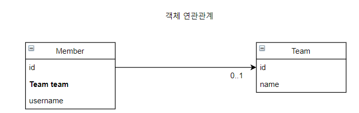
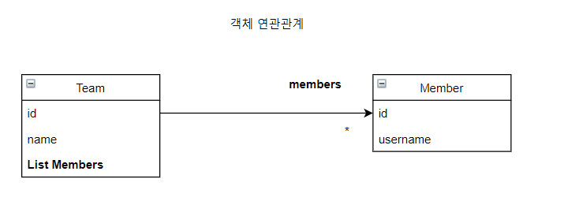
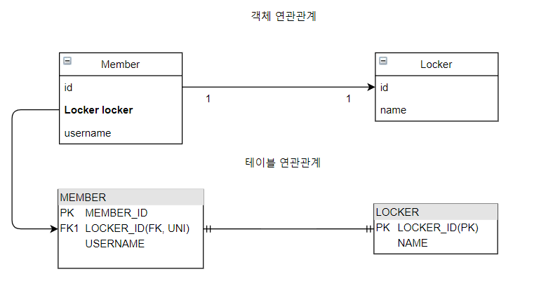
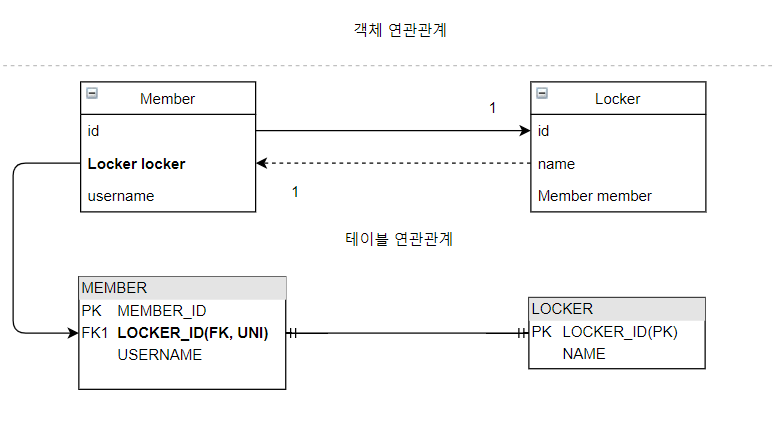
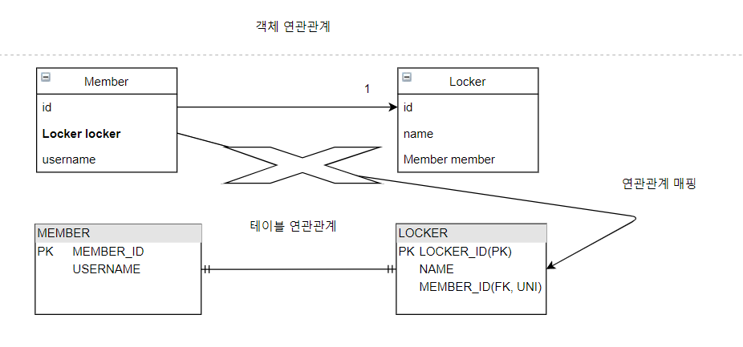
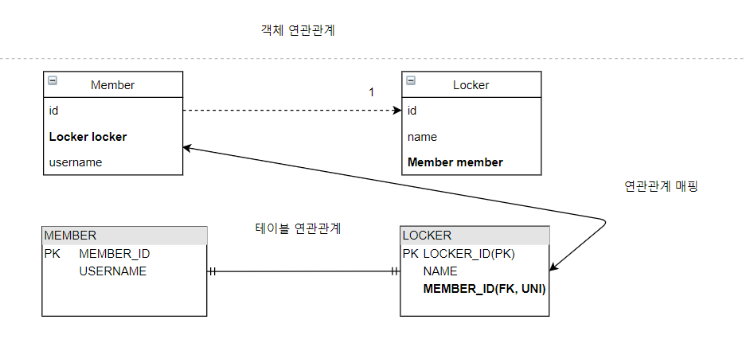
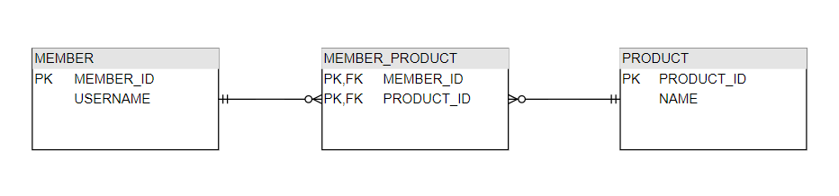
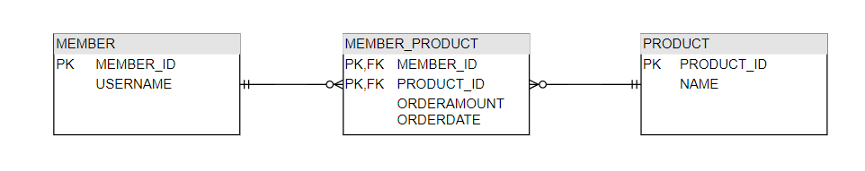
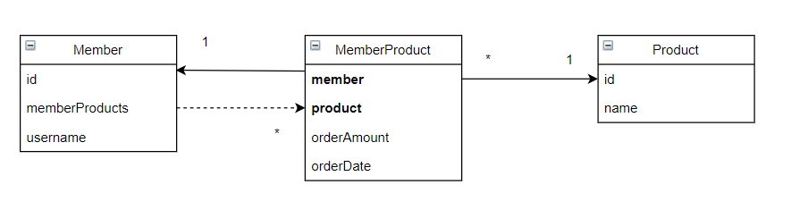

# 6장 다양한 연관관계 매핑

## 목차

- 다대일
- 일대다
- 일대일
- 다대다

## 다대일

- 데이터베이스 테이블의 일(1), 다(N) 관계에서 외래 키는 항상 다쪽에 있습니다.
- 즉, 객체 양방향 관계에서 연관관계의 주인은 항상 다쪽입니다.
- 예를 들어 회원과 팀이 다대일 관계일때 회원 쪽이 연관관계의 주인입니다.

### 다대일 단방향(N:1)

- 회원과 팀이 다대일 단방향 관계일때 회원에서는 팀을 참조할 수 있지만, 팀 객체는 회원을 참조할 수 없습니다.



```java
public class Member {
    @ManyToOne
    @JoinColumn(name = "TEAM_ID")
    private Team team;
}
```

- @JoinColumn(name = "TEAM_ID")를 사용해서 Member.team 필드를 TEAM_ID 외래 키와 매핑하였습니다.
- 즉, Member.team 필드로 회원 테이블의 TEAM_ID 외래키를 관리합니다.

### 다대일 양방향(N:1, 1:N)

- 회원과 팀이 다대일 양방향 관계일때 회원에서 팀 객체를 참조할 수 있고, 팀 객체에서도 회원들을 참조할 수 있습니다.

```java
public class Member {
    @ManyToOne
    @JoinColumn(name = "TEAM_ID")
    private Team team;
}

public class Team {
    @OneToMany(mappedBy = "team")
    private List<Member> members = new ArrayList<>();
}
```

#### 양방향은 외래 키가 있는 쪽이 연관관계의 주인입니다.

- 일대다와 다대일 연관관계는 항상 다(N)에 외래 키가 있습니다.
- 회원과 팀은 다대일 관계이고 회원이 다(N)쪽에 있으므로 회원이 연관관계의 주인입니다.

#### 양방향 연관관계는 항상 서로를 참조해야 합니다.

- 양방향 연관관계는 항상 서로 참조해야 합니다.
- 항상 서로 참조하게 하려면 연관관계 편의 메소드를 작성하는 것이 좋습니다.
- 연관관계 편의 메소드는 한곳에만 작성하거나 양쪽 다 작성할 수는 있지만, 양쪽에 다 작성하면 무한루프에 빠지므로 주의해야 합니다.

회원의 팀 객체애 대한 연관관계 편의 메소드

```
public void setTeam(Team team){
    this.team = team;
    
    if(!team.getMembers().contains(this)){
        team.getMembers().add(this);
    }
}
```

팀의 회원 객체에 대한 연관관계 편의 메소드

```
public void addMember(Member member){
    this.members.add(member);
    
    if(member.getTeam() != this){
       member.setTeam(this);
    }
}
```

## 일대다

### 일대다 단방향(1:N)

- 하나의 팀은 여러 회원을 참조할 수 있는데 이런 관계를 일대다 관계라 합니다.
- 팀과 회원이 일대다 단방향 관계이면 팀은 회원들을 참조할 수 있지만, 회원은 팀을 참조할 수 없는 없습니다.



- 팀 엔티티의 Team.members로 회원 테이블의 TEAM_ID 외래 키를 관리합니다.
- 보통 자신이 매핑한 테이블의 외래키(Member.team)를 관리하는데, 이 매핑은 반대쪽 테이블(MEMBER)에 있는 외래 키(TEAM_ID)를 관리합니다.
- 즉, 팀 엔티티 객체가 MEMBER 테이블의 TEAM_ID 외래키를 관리하게 되는 형태입니다.

```java

@Entity
public class Team {
    @OneToMany
    @JoinColumn(name = "TEAM_ID") // MEMBER 테이블의 TEAM_ID (FK)
    private List<Member> members = new ArrayList<>();
}

@Entity
public class Member {
    @Id
    @GeneratedValue
    @Column(name = "MEMBER_ID")
    private Long id;

    private String username;

    // getter, setter
}
```

- 일대다 단방향 관계를 매핑할 때는 @JoinColumndmf 명시해야 합니다.

#### 일대다 단방향 매핑의 단점

- 다른 테이블에 외래 키가 있으면 연관관계 처리를 위한 UPDATE SQL을 추가로 실행해야 합니다.
    - 예를 들어 매핑한 객체(Team)가 관리하는 외래 키(MEMBER.TEAM_ID)가 다른 테이블(MEMBER)에 있습니다.

```
public void testSave(){
    Member member1 = new Member("member1");
    Member member2 = new Member("member2");
    
    Team team1 = new Team("team1");
    team1.getMembers().add(member1);
    team1.getMembers().add(member2);
    
    em.persist(member1); // INSERT - member1
    em.persist(member2); // INSERT - member2
    em.persist(team1); // INSERT - team1, UPDATE - member1.fk, UPDATE - member2.fk
    
    transaction.commit();    
}
```

```
insert into Member (MEMBER_ID, username) values (null, ?)
insert into Member (MEMBER_ID, username) values (null, ?)
insert into Team (TEAM_ID, name) values (null, ?)
update Member set TEAM_ID=? where MEMBER_ID=?
update Member set TEAM_ID=? where MEMBER_ID=?
```

- Member 엔티티를 저장할 때 MEMBER 테이블의 TEAM_ID에는 아무 값도 저장되지 않습니다.
- Team 엔티티를 저장할 때 Team.members의 참조 값을 확인해서 회원 테이블에 있는 TEAM_ID 외래 키를 업데이트합니다.
- Team 엔티티가 회원 테이블의 TEAM_ID 외래 키를 업데이트하는 이유는 Member 엔티티는 Team 객체에 대한 참조를 하지 않는 관계이기 때문입니다.
    - 이러한 관계가 Team 엔티티가 MEMBER 테이블의 TEAM_ID 외래 키를 관리한다는 의미입니다.

#### 일대다 단방향 매핑보다는 다대일 양방향 매핑을 사용하자

- 일대다 단방향 매핑을 사용하면 엔티티(Team)를 매핑한 테이블(TEAM)이 아닌 다른 테이블(MEMBER)의 외래 키를 관리해야 합니다.
    - 성능 문제, 관리 부담 증가
- 일대다 단방향 매핑 문제 해결 방법은 다대일 양방향 매핑으로 변경하는 것입니다.
    - 관리해야 하는 외래 키가 본인 테이블에 있습니다.
    - 일대다 단방향 매핑의 문제점인 다른 테이블의 외래 키를 관리해야 하는 문제가 발생하지 않습니다.

### 일대다 양방향(1:N, N:1)

- 일대다 양방향 매핑은 존재하지 않습니다.
- 다대일 양방향 매핑을 사용해야 합니다.
    - 일대다 양방향과 다대일 양방향은 같은 말이지만 왼쪽을 연관관계의 주인으로 가정해서 분류했습니다. 예를 들어 다대일이면 다(N)가 연관관계의 주입니다.
- 양방향 매핑에서 @OneToMany는 연관관계의 주인이 될 수 없습니다.
    - 왜? 관계형 데이터베이스 특성상 일대다, 다대일 관계는 항상 다 쪽에 외래키가 있기 때문입니다.
- 따라서 @OneToMany, @ManyToOne 둘중에 연관관계의 주인은 항상 다 쪽인 @ManyToOne를 사용한 곳입니다.
- @ManyToOne에는 mappedBy 속성이 없습니다.

## 일대일(1:1)

일대일 관계의 특징은 다음과 같습니다.

- 일대일 관계는 그 반대도 일대일 관계입니다.
- 일대일 관계는 주 테이블이나 대상 테이블 둘 중 어느 곳이나 외래 키를 가질 수 있습니다.
    - 따라서 일대일 관계는 주 테이블이나 대상 테이블 중에 누가 외래 키를 가질지 선택해야 합니다.

#### 주 테이블에 외래 키

- 주 객체가 대상 객체를 참조하는 것처럼 주 테이블에 외래 키를 두고 대상 테이블을 참조합니다.
- 주 테이블이 외래 키를 가지고 있으므로 주 테이블만 확인해도 대상 테이블과 연관관계가 있는지 알 수 있습니다.

#### 대상 테이블에 외래 키

- 전통적인 데이터베이스 개발자들은 보통 대상 테이블에 외래 키를 두는 것을 선호합니다.
- 장점은 텡비ㅡㄹ 관계를 일대일에서 일대다로 변경 할 때 테이블 구조를 그대로 유지할 수 있습니다.

### 주 테이블에 외래 키

#### 단방향

- 주 테이블 : MEMBER
- 대상 테이블 : LOCKER



```java

@Entity
public class Member {
    // ...
    @OneToOne
    @JoinColumn(name = "LOCKER_ID")
    private Locker locker;
}

@Entity
public class Locker {
    @Id
    @GeneratedValue
    @Column(name = "LOCKER_ID")
    private Long id;
    private String name;
}
```

- 회원과 사물함이 일대일 단방향 관계이기 때문에 회원은 사물함을 참조할 수 있지만, 사물함 엔티티는 회원을 참조할 수 없습니다.

#### 양방향

회원과 사물함이 일대일 양방향 관계이면 다음과 같습니다.



위 객체 연관관계를 코드로 표현하면 다음과 같습니다.

```java

@Entity
public class Member {
    // ...
    @OneToOne
    @JoinColumn(name = "LOCKER_ID")
    private Locker locker;
}

@Entity
public class Locker {
    @Id
    @GeneratedValue
    @Column(name = "LOCKER_ID")
    private Long id;
    private String name;

    @OneToOne(mappedBy = "locker")
    private Member member;
}
```

- MEMBER 테이블이 외래 키(LOCKER_ID)를 가지고 있으므로 Member 엔티티에 있는 Member.locker가 연관관계의 주인입니다.
- 반대 매핑인 사물함의 Locker.member는 mappedBy를 선언해서 연관관계의 주인이 아니라고 설정합니다.

### 대상 테이블에 외래 키

#### 단방향

- 일대일 관계 중 대상 테이블에 외래 키가 있는 단방향 관계는 JPA에서 지원하지 않습니다.
    - 해결하기 위해서는 단방향 관계를 Locker에서 Member 방향으로 방향을 수정하거나 양방향 관계로 만들고 Locker를 연관관계의 주인으로 설정해야 합니다.



#### 양방향

다음 그림은 일대일 양방향 관계를 나타낸 그림입니다.



위 그림을 기반으로 코드로 표현하면 다음과 같습니다.

```java

@Entity
public class Member {
    // ...
    @OneToOne(mappedBy = "member")
    private Locker locker;
}

@Entity
public class Locker {
    // ...
    @OneToOne
    @JoinColumn(name = "MEMBER_ID")
    private Member member;

}
```

- 일대일 매핑에서 대상 테이블(LOCKER)에 외래 키를 두고 있으면 이렇게 양방향으로 매핑합니다.

## 다대다(N:N)

- 관계형 데이터베이스는 정규화된 테이블 2개로 다대다 관계를 표현할 수 없습니다.
- 다대다 관계를 중간 테이블을 두더 일대다, 다대일 관계로 풀어야 합니다.



엔티티 객체는 테이블과 다르게 객체 2개로 다대다 관계를 만들 수 있습니다.

### 다대다: 단방향

회원과 상품이 다대다 단방향 관계인 경우 다음과 같이 객체를 구현할 수 있습니다.

```java

@Entity
public class Member {
    // ...
    @ManyToMany
    @JoinTable(name = "MEMBER_PRODUCT",
            joinColumns = @JoinColumn(name = "MEMBER_ID"),
            inverseJoinColumns = @JoinColumn(name = "PRODUCT_ID"))
    private List<Product> products = new ArrayList<>();

}

@Entity
public class Product {
    @Id
    @Column(name = "PRODUCT_ID")
    private String id;

    private String name;

    //...
}
```

- 회원 엔티티와 상품 엔티티를 @ManyToMany로 매핑합니다.
- @ManyToMany와 @JoinTable을 사용해서 연결 테이블을 바로 매핑합니다.
- 회원과 상품을 연결하는 회원_상품(MEMBER_PRODUCT) 엔티티 없이 매핑을 완료할 수 있습니다.

@JoinTable 속성 정리

- @JoinTable.name : 연결 테이블을 지정합니다.
- @JoinTable.joinColumns : 현재 방향인 회원과 매핑할 조인 컬럼 정보를 지정합니다. (MEMBER_ID)
- @JoinTable.inverseJoinColumns : 반대 방향인 상품과 매핑할 조인 컬럼 정보를 지정합니다. (PRODUCT_ID)

@ManyToMany 장점

- MEMBER_PRODUCT 테이블같은 연결 테이블이 필요 없어집니다.

### 다대다: 양방향

- 회원과 상품간에 다대다 양방향 관계인 경우 상품에서 회원을 참조하는 경우에 @ManyToMany를 사용합니다.
- 회원과 상품 중 원하는 곳에 연관관계의 주인을 지정합니다. (주인이 아닌 곳은 mappedBy 속성을 지정합니다.)

```java

@Entity
public class Product {

    //...
    @ManyToMany(mappedBy = "products")
    private List<Member> members;
}
```

### 다대다: 매핑의 한계와 극복, 연결 엔티티 사용

- 회원과 상품간에 추가적인 정보를 저장하고 싶은 경우 @ManyToMany 만으로는 한계가 있습니다.
- 연결 테이블에 추가적인 정보를 담을 수 밖에 없습니다.
- 예를 들어 회원과 상품간에 연결 테이블인 회원_상품(MEMBER_PRODUCT) 테이블에 주문 수량과 주문 날짜 정보를 저장해야 할 수 있습니다.



위 테이블 연관관계를 기반으로 객체 연관관계를 다음과 같이 표현할 수 있습니다.



```java

@Entity
public class Member {
    // ...

    // 역방향
    @OneToMany(mappedBy = "member")
    private List<MemberProduct> memberProducts;
}

@Entity
public class Product {
    // ...
    @Id
    @Column(name = "PRODUCT_ID")
    private String id;
    private String name;
}


@Entity
@IdClass(MemberProductId.class)
public class MemberProduct {

    @Id
    @ManyToOne
    @JoinColumn(name = "MEMBER_ID")
    private Member member; // MemberProductId.member와 연결

    @Id
    @ManyToOne
    @JoinColumn(name = "PRODUCT_ID")
    private Product product; // MemberProductId.product와 연결

    private int orderMount;

    private Date orderDate;
}

public class MemberProductId implements Serializable {

    private Long member; // MemberProduct.member와 연결
    private Long product; // MemberProduct.product와 연결

    // equals and hashcode
}


```

- 회원상품(MemberProduct) 엔티티에서 기본 키를 매핑하는 @Id와 외래 키를 매핑하는 @JoinColumn을 동시에 사용해서 기본키 + 외래 키를 한번에 매핑하였습니다.
- @IdClass를 사용해서 복합 기본 키를 매핑하였습니다.

#### 복합 기본키

- 회원 상품 엔티티는 기본키가 MEMBER_ID와 PRODUCT_ID로 이루어진 복합 기본키입니다.
- 복합 키를 위한 식별자 클래스(MemberProductId) 특징
    - 복합 키는 별도의 식별자 클래스로 만들어야 합니다. (MemberProductId 클래스)
    - Serializable 구현
    - equals와 hashCode 메소드 구현
    - 기본 생성자
    - 식별자 클래스는 public
    - @IdClass를 사용하는 방법 외에 @EmbeddedId를 사용하는 방법도 있습니다.

#### 식별 관계

- 식별 관계: 부모 테이블의 기본 키를 받아서 자신의 기본 키 + 외래 키로 사용하는 것
- 회원상품(MemberProduct)은 회원의 기본키를 받아서 자신의 기본키로 사용함과 동시에 회원과의 관계를 위한 외래키로 사용하였습니다.
- 상품의 기본키도 받아서 자신의 기본키로 사용함과 동시에 상품과의 관계를 위한 외래 키로 사용합니다.
- MemberProductId 식별자 클래스로 두 기본 키를 묶어서 복합키로 사용합니다.

### 다대다: 새로운 기본 키 사용

- 추천하는 기본 키 생성 전략 : 데이터베이스에서 자동으로 생성해주는 대리 키를 Long 값으로 사용하는 것
- 장점
    - 영구히 사용할 수 있으며, 간편하고 비즈니스에 의존하지 않습니다.
    - ORM 매핑 시에 복합키를 만들지 않고 매핑을 간단히 완성할 수 있습니다.


```java
@Entity
public class Order {
    @Id
    @GeneratedValue
    @Column(name = "ORDER_ID")
    private Long id;

    @ManyToOne
    @JoinColumn(name = "MEMBER_ID")
    private Member member;

    @ManyToOne
    @JoinColumn(name = "PRODUCT_ID")
    private Product product;

    private int orderAmount;
    private Date orderDate;
}

@Entity
public class Member {
    // ...
    @OneToMany(mappedBy = "member")
    private List<Order> orders = new ArrayList<>();
}

@Entity
public class Product{
    @Id @Column(name = "PRODUCT_ID")
    private String id;
    //...
}
```

### 다대다 연관관계 정리

- 식별 관계: 받아온 식별자를 기본키 + 외래키로 사용합니다.
- 비식별 관계 : 받아온 식별자는 외래키로만 사용하고 새로운 식별자를 추가합니다.
