# 7장 고급 매핑

## 목차

- 상속 관계 매핑
- @MappedSuperclass
- 복합 키와 식별 관계 매핑
- 조인 테이블
- 엔티티 하나에 여러 테이블 매핑

## 1. 상속 관계 매핑

슈퍼타입 서브타입 논리적인 모델을 실제 물리 모델인 테이블로 구현할 때 3가지 방법

- 각각의 테이블로 변환
    - 서브 타입 각각을 모두 테이블로 만들고 조회할 때 조인을 사용합니다. JPA 에서는 **조인 전략**이라 합니다.
- 통합 테이블로 변환
    - 테이블을 하나만 사용해서 통합합니다. JPA에서는 **단일 테이블 전략**이라 합니다.
- 서브타입 테이블로 변환
    - 서브 타입마다 하나의 테이블을 만듭니다. JPA에서는 **구현 클래스마다 테이블 전략**이라 합니다.

### 1.1 조인 전략

- 엔티티 각각을 모두 테이블로 만들고 자식 테이블이 부모 테이블의 기본키를 받아서 기본키 + 외래키로 사용하는 전략입니다.

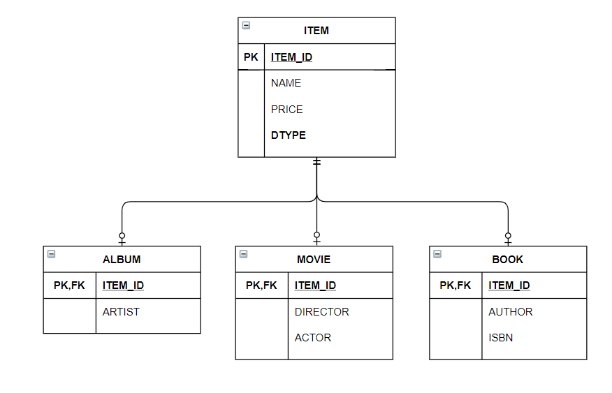

```java

@Entity
@Inheritance(strategy = InheritanceType.JOINED)
@DiscriminatorColumn(name = "DTYPE")
public abstract class Item {
    @Id
    @GeneratedValue
    @Column(name = "ITEM_ID")
    private Long id;

    private String name; // 이름
    private int price; // 가격
}

@Entity
@DiscriminatorValue("A")
public class Album extends Item {
    private String artist;
}

@Entity
@DiscriminatorValue("B")
@PrimaryKeyJoinColumn(name = "BOOK_ID")
public class Book extends Item {
    private String author;  // 작가
    private String isbn;    // ISBN
}

@Entity
@DiscriminatorValue("M")
public class Movie extends Item {
    private String director; // 감독
    private String actor; // 배우

}
```

- `@Inheritance(strategy = InheritanceType.JOINED)`
    - 상속 매핑은 부모 클래스에 `@Inheritance`를 사용해야 합니다.
    - 매핑 전략중 조인 전략 사용시 strategy 속성 값으로 `InheritanceType.JOINED`을 설정합니다.
- `@DiscriminatorColumn(name = "DTYPE")`
    - 부모 클래스에 구분 컬럼을 지정합니다.
    - `DTYPE`이라는 컬럼으로 자식 테이블을 구분할 수 있습니다.
    - 기본값이 `DTYPE`이기 때문에 @DiscriminatorColumn으로 줄여 사용할 수 있습니다.
- `@DiscriminatorValue("M")`
    - 엔티티 저장시 구분 컬럼(DTYPE)에 입력할 값을 지정합니다.
    - Movie 엔티티를 저장하면 구분 컬럼 값에 "M"이 저장됩니다.

#### 조인 전략 장점

- 테이블이 정규화됩니다.
- 외래 키 참조 무결성 제약조건을 활용할 수 있습니다.
- 저장공간을 효율적으로 사용합니다.

#### 조인 전략 단점

- 조회할 때 **조인이 많이 사용**되므로 성능이 저하될 수 있습니다.
- 조회 쿼리가 복잡합니다.
- 데이터를 등록할 **INSERT SQL을 두번 실행**합니다.

#### 조인 전략 특징

- JPA 표준 명세는 구분 컬럼을 사용하도록 하지만 하이버네이트를 포함한 몇몇 구현체는 **구분 컬럼(@DiscriminatorColumn)** 없이도 동작합니다.

#### 조인 전략 관련 애노테이션

- @PrimaryKeyJoinColumn
    - 자식 테이블의 기본 키 컬럼명을 재정의하는데 사용됩니다.
- @DiscriminatorColumn
    - 부모 클래스에 구분 컬럼을 지정합니다.
- @DiscriminatorValue
    - 엔티티 저장시 구분 컬럼에 입력값을 지정합니다.

### 1.2 단일 테이블 전략

- 단일 테이블 전략은 테이블을 하나만 사용하는 전략입니다.
- 구분 컬럼(DTYPE)으로 어던 자식 데이터가 저장되었는지 구분합니다.
- 조회할 때 조인을 사용하지 않으므로 일반적으로 가장 빠릅니다.


```java

@Entity
@Inheritance(strategy = InheritanceType.SINGLE_TABLE)
@DiscriminatorColumn(name = "DTYPE")
public abstract class Item {
    @Id
    @GeneratedValue
    @Column(name = "ITEM_ID")
    private Long id;

    private String name; // 이름
    private int price; // 가격
}

@Entity
@DiscriminatorValue("A")
public class Album extends Item {
    private String artist;
}

@Entity
@DiscriminatorValue("B")
public class Book extends Item {
    private String author;  // 작가
    private String isbn;    // ISBN
}

@Entity
@DiscriminatorValue("M")
public class Movie extends Item {
    private String director; // 감독
    private String actor; // 배우

}

```

- @Inheritance(strategy = InheritanceType.SINGLE_TABLE)
    - 단일 테이블 전략을 사용합니다.

#### 단일 테이블 전략 장점

- 조인이 필요 없으므로 일반적으로 조회 성능이 빠릅니다.
- 조회 쿼리가 단순합니다.

#### 단일 테이블 전략 단점

- 자식 엔티티가 매핑한 컬럼은 모두 null을 허용해야 합니다.
- 단일 테이블에 모든 것을 저장하기 때문에 테이블이 커질 수 있습니다. 따라서 상황에 따라서 조회 성능이 오히려 느려질 수 있습니다.

#### 단일 테이블 전략 특징

- 구분 컬럼을 반드시 사용해야 합니다.
- `@DiscrinminatorValue`를 지정하지 않으면 기본적으로 엔티티 이름을 사용합니다. (ex, Movie, Album, Book)

### 1.3 구현 클래스마다 테이블 전략

- 자식 엔티티 마다 테이블을 만드는 전략입니다.
- 자식 테이블 각각에 필요한 컬럼이 모두 있습니다.


```java

@Entity
@Inheritance(strategy = InheritanceType.TABLE_PER_CLASS)
public abstract class Item {
    @Id
    @GeneratedValue
    @Column(name = "ITEM_ID")
    private Long id;

    private String name; // 이름
    private int price; // 가격
}

@Entity
public class Album extends Item {
    private String artist;
}

@Entity
public class Book extends Item {
    private String author;  // 작가
    private String isbn;    // ISBN
}

@Entity
public class Movie extends Item {
    private String director; // 감독
    private String actor; // 배우

}

```

- @Inheritance(strategy = InheritanceType.TABLE_PER_CLASS)
    - 구현 클래스마다 테이블 전략을 사용합니다.
    - 자식 엔티티마다 테이블을 생성합니다.

#### 구현 클래스마다 테이블 전략 장점

- 서브 타입을 구분해서 처리할 때 효과적입니다.
- not null 제약조건을 사용할 수 있습니다.

#### 구현 클래스마다 테이블 전략 단점

- 여러 자식 테이블을 함께 조회할 때 성능이 느립니다.
- 자식 테이블을 통합해서 쿼리하기 어렵습니다.

#### 구현 클래스마다 테이블 전략 특징

- 구분 컬럼을 사용하지 않습니다.

## 2. @MappedSuperclass

- 부모 클래스는 테이블과 매핑하지 않고 부모 클래스를 상속받는 자식 클래스에게 매핑 정보만 제공하고 싶은 경우에 사용합니다.
- @MappedSuperclass가 적용된 클래스는 실제 테이블과 매핑되지 않습니다.

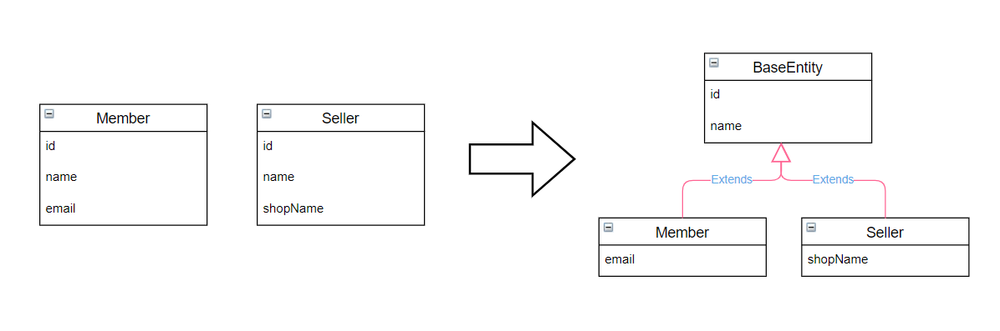

```java

@MappedSuperclass
public abstract class BaseEntity {
    @Id
    @GeneratedValue
    private Long id;
    private String name;
}


@Entity
// 부모로부터 물려받은 매핑 정보 재정의 (선택적)
@AttributeOverrides({
        @AttributeOverride(name = "id", column = @Column(name = "MEMBER_ID")),
        @AttributeOverride(name = "name", column = @Column(name = "MEMBER_NAME"))
})
public class Member extends BaseEntity {
    // ID 상속
    // NAME 상속
    private String email;
}

@Entity
public class Seller extends BaseEntity {
    private String shopName;
}
```

- BaseEntity에는 객체들이 주로 사용하는 공통 매핑 정보를 정의합니다.
- 자식 엔티티들은 상속을 통해 BaseEntity의 매핑 정보를 물려받습니다.
- @AttributeOverrides, @AttributeOrverride
    - 부모로부터 물려받은 매핑 정보를 재정의하는데 사용됩니다.
- @MappedSuperclass 사용시 등록일자, 수정일자, 등록자, 수정같은 여러 엔티티에서 공통으로 사용하는 속성을 효과적으로 관리할 수 있습니다.

## 3. 복합 키와 식별 관계 매핑

### 3.1 식별 관계 vs 비식별 관계

데이터베이스 테이블 사이의 관계는 **외래키가 기본키에 포함되는지 여부**에 따라 식별 관계와 비식별 관계로 구분됩니다.

외래키가 기본키에 포함되면 두 테이블 사이의 관계는 식별 관계입니다.

외래키가 기본키에 포함되지 않으면 두 테이블 사이의 관계 비식별 관계입니다.

### 식별 관계

식별 관계는 부모 테이블의 기본 키를 내려받아서 자식 테이블의 기본키 + 외래키로 사용하는 관계입니다.

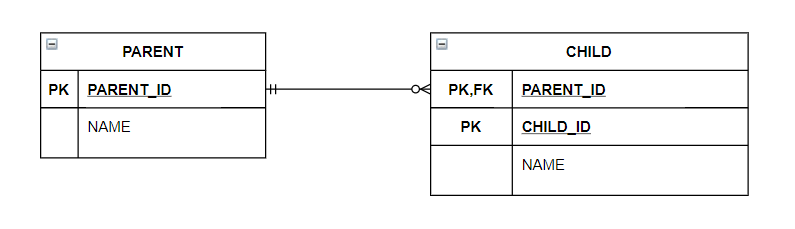

### 비식별 관계

비식별 관계는 부모 테이블의 기본 키를 내려받아서 자식 테이블의 외래키로만 사용하는 관계입니다.

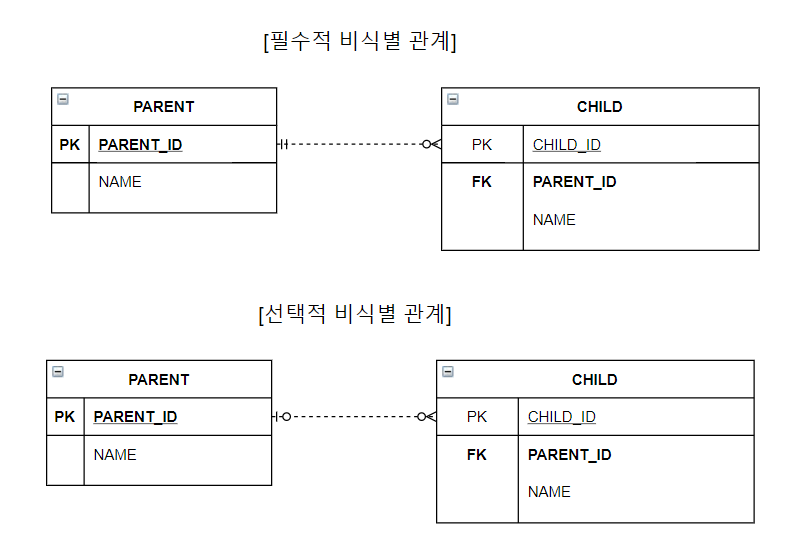

- **필수적 비식별 관계**
    - 외래 키에 NULL을 허용하지 않습니다.
    - 연관관계를 필수적으로 맺어야 합니다.
- 선택적 비식별 관계
    - 외래 키에 NULL을 허용합니다.
    - 연관관계를 선택적으로 맺을 수 있습니다.

### 3.2 복합키: 비식별 관계 매핑

- 식별자 필드가 2개 이상이면 별도의 식별자 클래스를 만들고 그곳에 equals와 hashCode를 구현해야 합니다.
- JPA는 복합 키를 지원하기 위해 `@IdClass`와 `@EmbeddedId` 2가지 방법을 제공합니다.

### @IdClass

- `@IdClass`를 사용해서 특정 클래스를 식별자 클래스로 지정할 수 있습니다.

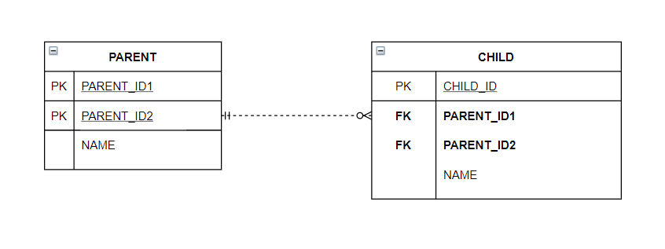

- PARENT는 복합 키를 사용합니다.
- PARENT와 CHILD는 일대다 선택적 비식별 관계입니다.
- PARENT와 CHILD는 상속과 무관하고 단지 테이블의 키를 내려받은 것을 강조하기 위한 것입니다.

```java

@Getter
@Setter
@Entity
@IdClass(ParentId.class)
public class Parent {

    @Id
    @Column(name = "PARENT_ID1", insertable = false, updatable = false)
    private String id1; // ParentId.id1과 연결
    @Id
    @Column(name = "PARENT_ID2", insertable = false, updatable = false)
    private String id2; // ParentId.id2와 연결

    private String name;
}

@NoArgsConstructor
@AllArgsConstructor
@EqualsAndHashCode(of = {"id1", "id2"})
public class ParentId implements Serializable {
    private String id1; // Parent.id1 매핑
    private String id2; // Parent.id2 매핑
}

@Getter
@Setter
@Entity
public class Child {
    @Id
    private String id;

    @ManyToOne
    @JoinColumns({
            @JoinColumn(name = "PARENT_ID1", referencedColumnName = "PARENT_ID1"),
            @JoinColumn(name = "PARENT_ID2", referencedColumnName = "PARENT_ID2")
    })
    private Parent parent;
}

```

- 부모 테이블의 기본 키 컬럼이 복합 키이므로 자식 테이블의 외래 키도 복합키입니다.
- 외래 키 매핑시 여러 컬럼을 매핑해야 하므로 `@JoinColumns` 애노테이션을 사용하고 각각의 외래키 컬럼을 `@JoinColumn`으로 매핑합니다.
- @JoinColumn의 name 속성과 referencedColumnName 속성 값이 동일하면 referencedColumnName 속성을 생략할 수 있습니다.

#### @IdClass에 사용한 식별자 클래스 조건

- `Serializable` 인터페이스를 구현해야 합니다.
- `equals`, `hashCode`를 구현해야 합니다.
- 기본 생성자가 존재해야 합니다.
- 식별자 클래스는 `public`이어야 합니다.

### @EmbeddedId

- `@EmbeddedId`를 적용한 식별자 클래스는 식별자 클래스에 기본 키를 직접 매핑합니다.

#### @EmbeddedId 조건

- 식별자 클래스에 `@Embeddable` 애노테이션을 붙여야 합니다.
- `Serilizable` 인터페이스를 구현해야 합니다.
- equals, hashCode를 구현해야 합니다.
- 기본 생성자가 있어야 합니다.
- 식별자 클래스는 public이어야 합니다.

```java

@Getter
@Setter
@Entity
public class Parent {

    @EmbeddedId
    private ParentId id;

    private String name;
}

@Getter
@NoArgsConstructor
@AllArgsConstructor
@EqualsAndHashCode(of = {"id1", "id2"})
@Embeddable
public class ParentId implements Serializable {

    @Column(name = "PARENT_ID1")
    private String id1;

    @Column(name = "PARENT_ID2")
    private String id2;
}

@Getter
@Setter
@Entity
public class Child {
    @Id
    private String id;

    @ManyToOne
    @JoinColumns({
            @JoinColumn(name = "PARENT_ID1", referencedColumnName = "PARENT_ID1"),
            @JoinColumn(name = "PARENT_ID2", referencedColumnName = "PARENT_ID2")
    })
    private Parent parent;
}
```

### 복합키와 equals()와 hashCode()

- 영속성 컨텍스트는 엔티티의 식별자를 키로 사용해서 엔티티를 관리합니다.
- 식별자를 비교할 때 equals()와 hashCode()를 사용합니다.
- 식별자 객체의 동등성이 지켜지지 않으면 예상과 다른 엔티티가 조회하거나 엔티티를 찾을 수 없는 등 영속성 컨텍스트가 엔티티를 관리하는데 심각한 문제가 발생합니다.

### @IdClass vs @EmbeddedId

- @EmbeddedId 사용시 @IdClass보다 JPQL이 더 길어질 수 있습니다.

```
em.createQuery("select p.id.id1, p.id.id2 from Parent p");  // @EmbeddedId
em.createQuery("select p.id1, p.id2 from Parent p");        // @IdClass
```

### 3.3 복합키: 식별 관계 매핑


- 부모, 자식, 손자까지 계속 기본키를 전달하는 식별 관계입니다.
- 식별 관계에서 자식 테이블은 부모 테이블의 키본키를 포함해서 복합 키를 구성해야 하므로 @IdClass나 @EmbeddedId를 사용해서 식별자를 매핑해야 합니다.

### @IdClass와 식별 관계

```java

@NoArgsConstructor
@AllArgsConstructor
@Getter
@Entity
public class Parent {
    @Id
    @Column(name = "PARENT_ID")
    private String id;
    private String name;
}

@NoArgsConstructor
@AllArgsConstructor
@Getter
@Entity
@IdClass(ChildId.class)
public class Child {
    @Id
    @ManyToOne
    @JoinColumn(name = "PARENT_ID")
    public Parent parent;

    @Id
    @Column(name = "CHILD_ID")
    private String childId;
    private String name;
}

@NoArgsConstructor
@AllArgsConstructor
@EqualsAndHashCode(of = {"parent", "childId"})
public class ChildId implements Serializable {
    private String parent; // Child.parent 매핑
    private String childId; // Child.childId 매핑
}

@NoArgsConstructor
@AllArgsConstructor
@Getter
@Entity
@IdClass(GrandChildId.class)
public class GrandChild {
    @Id
    @ManyToOne
    @JoinColumns({
            @JoinColumn(name = "PARENT_ID"),
            @JoinColumn(name = "CHILD_ID")
    })
    private Child child;

    @Id
    @Column(name = "GRANDCHILD_ID")
    private String id;

    private String name;
}

@NoArgsConstructor
@AllArgsConstructor
@EqualsAndHashCode(of = {"child", "id"})
public class GrandChildId implements Serializable {

    private ChildId child; // GrandChild.child 매핑
    private String id;      // GrandChild.id 매핑
}

```

### @EmbeddedId와 식별 관계

```java

@Getter
@NoArgsConstructor
@AllArgsConstructor
@Entity
public class Parent {
    @Id
    @Column(name = "PARENT_ID")
    private String id;

    private String name;
}

@Getter
@NoArgsConstructor
@AllArgsConstructor
@Entity
public class Child {
    @EmbeddedId
    private ChildId id;

    @MapsId("parentId") // ChildId.parentId 매핑
    @ManyToOne
    @JoinColumn(name = "PARENT_ID")
    public Parent parent;

    private String name;
}

@Embeddable
@EqualsAndHashCode(of = {"parentId", "id"})
@NoArgsConstructor
@AllArgsConstructor
public class ChildId implements Serializable {
    private String parentId; // @MpasId("parentId")로 매핑

    @Column(name = "CHILD_ID")
    private String id;
}

@Getter
@NoArgsConstructor
@AllArgsConstructor
@Entity
public class GrandChild {
    @EmbeddedId
    private GrandChildId id;

    @MapsId("childId") // GrandChildId.childId 매핑
    @ManyToOne
    @JoinColumns(value = {
            @JoinColumn(name = "PARENT_ID"),
            @JoinColumn(name = "CHILD_ID")
    })
    private Child child;

    private String name;
}

@NoArgsConstructor
@AllArgsConstructor
@Getter
@Embeddable
public class GrandChildId implements Serializable {

    private ChildId childId; // @MapsId("childId")로 매핑

    @Column(name = "GRANDCHILD_ID")
    private String id;
}
```

- `@EmbeddedId`는 식별 관계로 사용할 연관관계의 속성에 `@MapsId`를 사용하면 됩니다.
- `@IdClass`와 다른점은 `@Id` 대신에 `@MapsId`를 사용합니다.
- @MpasId는 외래키와 매핑한 연관관계를 기본 키에도 매핑하겠다는 의미입니다.

### 3.4 비식별 관계로 구현

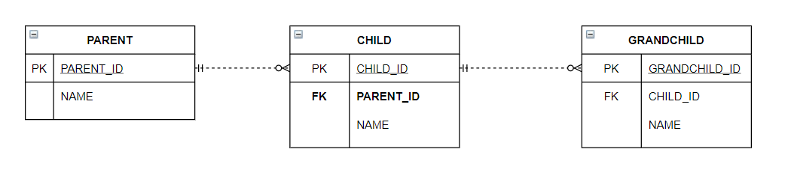

```java

@NoArgsConstructor
@AllArgsConstructor
@Getter
@Entity
public class Parent {
    @Id
    @GeneratedValue
    @Column(name = "PARENT_ID")
    private Long id;

    private String name;
}

@NoArgsConstructor
@AllArgsConstructor
@Getter
@Entity
public class Child {
    @Id
    @GeneratedValue
    @Column(name = "CHILD_ID")
    private Long id;

    @ManyToOne
    @JoinColumn(name = "PARENT_ID")
    private Parent parent;

    private String name;
}

@NoArgsConstructor
@AllArgsConstructor
@Getter
@Entity
public class GrandChild {
    @Id
    @GeneratedValue
    @Column(name = "GRANDCHILD_ID")
    private Long id;

    @ManyToOne
    @JoinColumn(name = "CHILD_ID")
    private Child child;

    private String name;
}
```

### 3.5 일대일 식별 관계


- 일대일 식별 관계는 자식 테이블의 기본 키값으로 부모 테이블의 기본 키 값만 사용합니다.
- 부모 테이블의 기본 키가 복합 키가 아니면 자식 테이블의 기본 키는 복합 키로 구성하지 않아도 됩니다.

```java

@NoArgsConstructor
@AllArgsConstructor
@Getter
@Entity
public class Board {
    @Id
    @GeneratedValue
    @Column(name = "BOARD_ID")
    private Long id;
    private String title;

    @OneToOne(mappedBy = "board")
    private BoardDetail boardDetail;
}

@NoArgsConstructor
@AllArgsConstructor
@Getter
@Entity
public class BoardDetail {
    @Id
    private Long boardId;

    @MapsId // BoardDetail.boardId 매핑
    @OneToOne
    @JoinColumn(name = "BOARD_ID")
    private Board board;

    private String content;
}
```

- `@MapsId`는 @Id를 사용해서 식별자로 지정한 BoardDetail.boardId와 매핑됩니다.

### 3.6 식별, 비식별 관계의 장단점

다음과 같은 이유로 식별 관계보다 비식별 관계를 선호합니다.

- 식별 관계는 부모 테이블의 기본키를 자식 테이블로 전파하면서 자식 테이블의 기본키 컬럼이 점자 늘어납니다.
- 식별 관게는 2개 이상의 컬럼을 합해서 복합 기본키를 만들어야 하는 경우가 많습니다.
- 식별 관계를 사용할때 기본키로 비즈니스 의미가 있는 자연 키 컬럼을 조합하는 경우가 많습니다.
- 식별 관계는 부모 테이블의 기본키를 자식 테이블의 기본키로 사용하므로 비식별 관계보다 테이블 궂과 유연하지 못합니다.

객체 관계 매핑 관점에서 보는 비식별 관게를 선호하는 이유

- 컬럼이 하나인 기본 키를 매핑하는 것보다 복합키를 식별 관게로 매핑하는 것은 많은 노력이 필요하기 때문입니다.
- 비식별 관계의 기본 키는 주로 대리 키를 사용하는데 JPA는 `@GenerateValue`처럼 대리 키를 생성하기 위한 편리한 방법을 제공합니다.

식별 관계가 비식별 관계보다 가지는 장점

- 기본 키 인덱스를 활용하기 좋습니다.
- 상위 테이블들의 기본 키 컬럼을 자식, 손자 테이블들이 가지고 있으므로 특정 상황에 조인 없이 하위 테이블만으로 검색을 완료할 수 있습니다.

부모 아이디가 A인 모든 자식 조회

```
SELECT * FROM CHILD
WHERE PARENT_ID = 'A'
```

부모 아이디가 A고 자식 아이디가 B인 자식 조회

```
SELECT * FROM CHILD
WHERE PARENT_ID = 'A' AND CHILD_ID = 'B'
```

위 두 경우 모두 인덱스를 생성할 필요없이 기본 키 인덱스만 사용해도 됩니다.

## 4. 조인 테이블

데이터베이스 테이블의 연관관계를 설계하는 방법 2가지

- 조인 컬럼 사용(외래 키 사용)
- 조인 테이블 사용(테이블 사용)

#### 조인 컬럼 사용

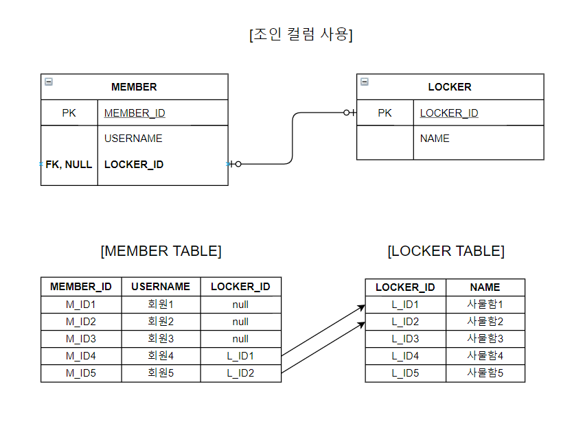

- 회원과 사물함 테이블의 관계는 일대일 선택적 비식별 관계입니다.
- 외래키가 선택적이기 때문에 외래키에 NULL을 허용합니다.
- 회원과 사물함을 조인할때 외부 조인(OUTER JOIN)해야 합니다.

#### 조인 테이블 사용

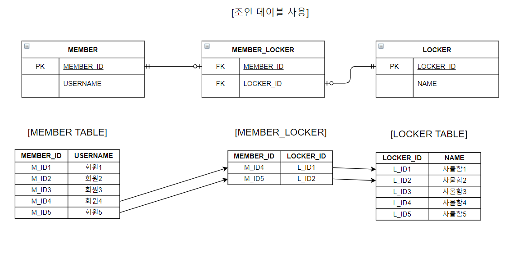

- 조인 테이블이라는 별도의 테이블을 사용해서 연관관계를 관리합니다.
- MEMBER와 LOCKER 테이블에는 연관관계를 관리하기 위한 외래키 컬럼이 없습니다.
- 단점은 테이블을 하나 더 추가해야합니다.
- 회원과 사물함 두 테이블을 조인시 MEMBER_LOCKER 테이블까지 추가로 조인해야 합니다.

### 4.1 일대일 조인 테이블

- 일대일 관계를 만들려면 조인 테이블의 외래 키 컬럼 각각에 총 2개의 유니크 제약조건을 걸어야 합니다. (PARNET_ID는 기본키이므로 유니크 제약 조건이 걸려 있습니다.)

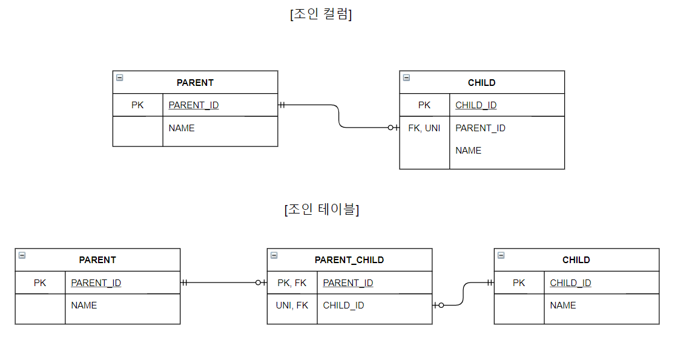

```java

@NoArgsConstructor
@AllArgsConstructor
@Getter
@Entity
public class Parent {
    @Id
    @GeneratedValue
    @Column(name = "PARENT_ID")
    private Long id;
    private String name;

    @OneToOne
    @JoinTable(name = "PARENT_CHILD",
            joinColumns = @JoinColumn(name = "PARENT_ID"),
            inverseJoinColumns = @JoinColumn(name = "CHILD_ID"))
    private Child child;
}

@NoArgsConstructor
@AllArgsConstructor
@Getter
@Entity
public class Child {
    @Id
    @GeneratedValue
    @Column(name = "CHILD_ID")
    private Long id;

    private String name;
}
```

- @JoinTable
    - name : 매핑할 조인 테이블 이름
    - joinColumns : 현재 엔티티를 참조하는 외래 키
    - inverseJoinColumns : 반대방향 엔티티를 참조하는 외래 키

### 4.2 일대다 조인 테이블

- 일대다 관계를 만들려면 조인 테이블의 컬럼 중 다(N)와 관련된 컬럼인 CHILD_ID에 유니크 제약 조건을 걸어야 합니다. (CHILD_ID는 기본키이므로 유니크 제약 조건이 걸려 있습니다.)

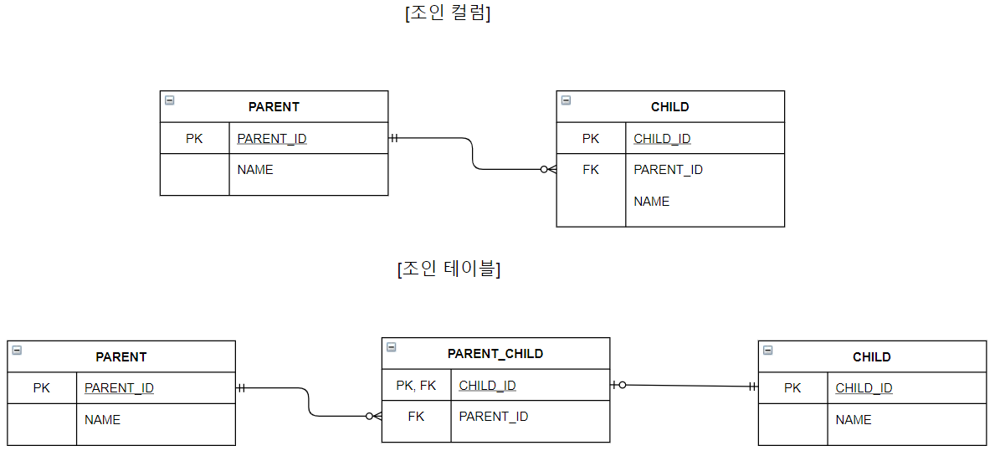

```java
@NoArgsConstructor
@AllArgsConstructor
@Getter
@Entity
public class Parent {
    @Id
    @GeneratedValue
    @Column(name = "PARENT_ID")
    private Long id;

    private String name;

    @OneToMany
    @JoinTable(name = "PARENT_CHILD",
            joinColumns = @JoinColumn(name = "PARENT_ID"),
            inverseJoinColumns = @JoinColumn(name = "CHILD_ID")
    )
    private List<Child> child = new ArrayList<>();
}

@NoArgsConstructor
@AllArgsConstructor
@Getter
@Entity
public class Child {
  @Id
  @GeneratedValue
  @Column(name = "CHILD_ID")
  private Long id;

  private String name;
}
```

### 4.3 다대일 조인 테이블

- 다대일은 일대다에서 방향만 반대이므로 조인 테이블 모양은 일대다 조인 테이블에서 보여준것과 같습니다.

```java
@NoArgsConstructor
@AllArgsConstructor
@Getter
@Entity
public class Parent {
    @Id
    @GeneratedValue
    @Column(name = "PARENT_ID")
    private Long id;

    private String name;

    @OneToMany(mappedBy = "parent")
    private List<Child> child = new ArrayList<>();
}

@NoArgsConstructor
@AllArgsConstructor
@Getter
@Entity
public class Child {
  @Id
  @GeneratedValue
  @Column(name = "CHILD_ID")
  private Long id;

  private String name;

  @ManyToOne(optional = false)
  @JoinTable(name = "PARENT_CHILD",
          joinColumns = @JoinColumn(name = "CHILD_ID"),
          inverseJoinColumns = @JoinColumn(name = "PARENT_ID"))
  private Parent parent;
}
```

### 4.4 다대다 조인 테이블

- 다대다 관계를 만들려면 조인 테이블의 두 컬럼을 합해서 하나의 복합 유니크 제약조건을 걸어야 합니다.
  - PARENT_ID, CHILD_ID는 복합 기본키이므로 유니크 제약 조건이 걸려 있습니다.

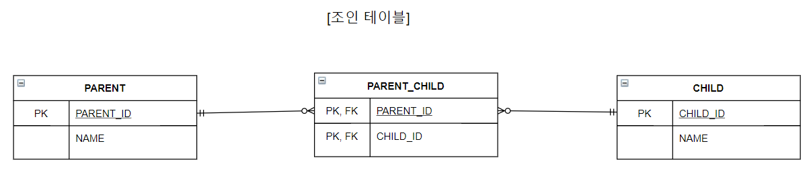

```java
@NoArgsConstructor
@AllArgsConstructor
@Getter
@Entity
public class Parent {
    @Id
    @GeneratedValue
    @Column(name = "PARENT_ID")
    private Long id;

    private String name;

    @ManyToMany
    @JoinTable(name = "PARENT_CHILD",
            joinColumns = @JoinColumn(name = "PARENT_ID"),
            inverseJoinColumns = @JoinColumn(name = "CHILD_ID"))
    private List<Child> child = new ArrayList<>();
}

@NoArgsConstructor
@AllArgsConstructor
@Getter
@Entity
public class Child {
  @Id
  @GeneratedValue
  @Column(name = "CHILD_ID")
  private Long id;

  private String name;
}
```

## 5. 엔티티 하나에 여러 테이블 매핑

- `@SecondaryTable`을 사용하면 한 엔티티에 여러 테이블을 매핑할 수 있습니다.

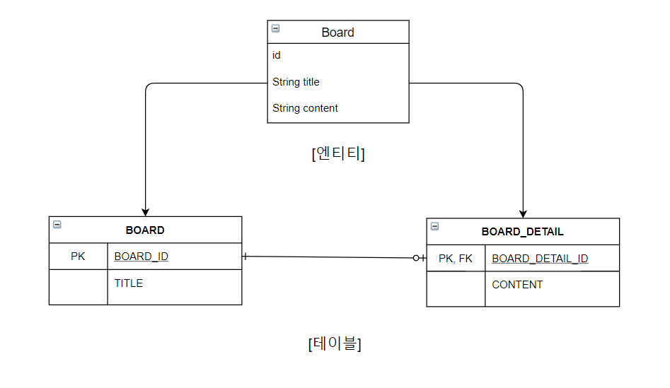

```java
@NoArgsConstructor
@AllArgsConstructor
@Getter
@Entity
@Table(name = "BOARD")
@SecondaryTable(name = "BOARD_DETAIL",
        pkJoinColumns = @PrimaryKeyJoinColumn(name = "BOARD_DETAIL_ID"))
public class Board {
    @Id
    @GeneratedValue
    @Column(name = "BOARD_ID")
    private Long id;

    private String title;

    @Column(table = "BOARD_DETAIL")
    private String content;
}

```

- `@Table`을 사용하여 BOARD 테이블과 매핑하였습니다.
- `@SecondaryTable`을 사용해서 BOARD_DETAIL 테이블을 추가로 매핑하였습니다.
  - name : 매핑할 다른 테이블의 이름
  - pkJoinColumn : 매핑할 다른 테이블의 기본 키 컬럼 속성
