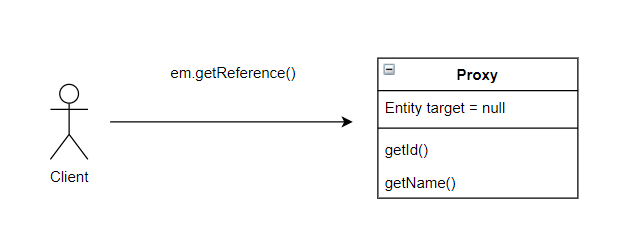
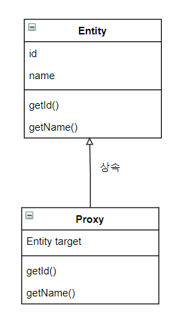
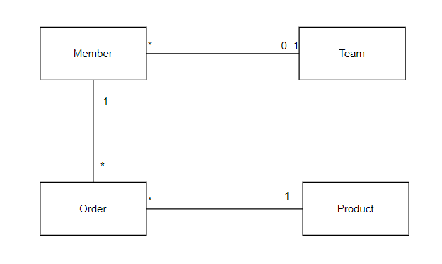

# 8장 프록시와 연관관계 관리

## 목차

- 프록시
- 즉시 로딩과 지연 로딩
- 지연 로딩 활용
- 영속성 전이: CASCADE
- 고아 객체
- 영속성 객체 + 고아 객체, 생명주기

## 개요

- 프록시와 즉시로딩, 지연로딩
    - 프록시를 사용하여 연관 엔티티 객체를 처음부터 데이터베이스에서 조회하는 것이 아니라, 실제 사용하는 시점에 데이터베이스에서 조회할 수 있습니다.
    - 자주 함께 사용하는 객체들은 조인을 사용해서 함께 조회하는 것이 효과적입니다.
    - JPA는 즉시로딩, 지연로딩 모두 지원합니다.
- 영속성 전이와 고아객체
    - JPA는 연관된 객체를 함께 저장하거나 함께 삭제하는 영속성 전이와 고아객체 제거라는 편리한 기능을 제공합니다.

## 1. 프록시

```java

@Getter
@NoArgsConstructor
@AllArgsConstructor
@Entity
public class Member {

    @Id
    private String memberId;

    private String username;

    @ManyToOne
    @JoinColumn(name = "TEAM_ID")
    private Team team;

}

@Getter
@NoArgsConstructor
@AllArgsConstructor
@Entity
public class Team {

    @Id
    @Column(name = "TEAM_ID")
    private String teamId;

    private String name;
}

```

테스트 코드는 다음과 같습니다.

```
Member findMember = em.find(Member.class, "member1");
Team team2 = member.getTeam();
```

- em.find 메소드를 통하여 엔티티 객체 조회시 Member 객체의 연관 객체인 Team 객체에 대하여 즉시 로딩합니다.
- 즉시 로딩하기 때문에 em.find 메소드 호출시 조인을 통하여 같이 조회합니다.

만약 Team 객체를 자주 조회하지 않는다면 Member 객체 조회시 Team 객체를 조인하여 조회하지 않는 방법이 있을까?

- 지연 로딩을 사용하면 됩니다.

지연 로딩을 사용하는 이유는 무엇일까?

- 실제 사용하지 않는 객체까지 조회하는 것은 매우 효율적이지 않기 때문입니다.

지연 로딩 기능을 사용하려면 실제 엔티티 객체 대신에 데이터베이스 조회를 지연할 수 있는 가짜 객체가 필요합니다. 이 가짜 객체를 `프록시 객체`라고 합니다.

### 1.1 프록시 기초

JPA는 식별자로 엔티티 조회시 영속성 컨텍스트에 엔티티 정보가 없으면 데이터베이스 조회를 수행합니다.

그런데 이 조회하고자 하는 엔티티를 실제 사용하든 사용하지 않는 데이터베이스에서 조회하게 됩니다.

#### 엔티티를 실제 사용하는 시점까지 데이터베이스 조회를 미루고 싶은 경우 : em.getReference

em.getReference 메소드 호출시 JPA는 데이터베이스를 조회하지 않고 실제 엔티티 객체도 생성하지 않습니다.

대신 데이터베이스 접근을 위임한 프록시 객체를 반환합니다.

다음은 em.getReference 메소드를 호출하여 Member 엔티티 객체에 대한 프록시 객체를 반환받는 코드입니다.

```
Member member = em.getReference(Member.class, "member1");
```

위 코드에 대한 프록시 조회를 그림으로 표현하면 다음과 같습니다.



#### 프록시 특징

- 프록시 클래스는 실제 클래스를 상속 받기 때문에 실제 클래스의 멤버와 메소드가 같습니다.
- 클라이언트는 프록시 클래스인지 진짜 엔티티 클래스인지 구분하지 않고 사용하면 됩니다.
- 프록시 객체는 실제 객체에 대한 참조를 보관합니다.
- 프록시 객체의 메소드를 호출시 실제 객체의 메소드를 호출합니다.



#### 프록시 객체의 초기화

- 프록시 객체는 member.getName()처럼 **실제 사용될 때 데이터베이스를 조회해서 실제 엔티티 객체를 생성**합니다. 이것을 **프록시 객체의 초기화**라고 합니다.

```
Member member = em.getReference(Member.class, "member1"); // MemberProxy 객체 반환
member.getName(); // 프록시 객체 초기화
```

#### 프록시 클래스 예상 코드

```
class MemberProxy extends Member{
    Member entity = null; // 실제 엔티티 참조
  
  public String getName(){
      if(entity == null){
          // 2. 초기화 요청
          // 3. DB 조회
          // 4. 실제 엔티티 생성 및 참조 보관
          this.entity = ...;
      }
      
      // 5. entity.getName();
      return entity.getName(); 
  }
}
```

위 코드의 과정을 그림으로 표현하면 다음과 같습니다.


#### 프록시의 특징

- 프록시 객체는 처음 사용할때 한번만 초기화됩니다.
- 프록시 객체를 초기화한다고 프록시 객체가 실제 엔티티로 바뀌는 것은 아닙니다.
    - 프록시 객체가 초기화되면 프록시 객체를 통해서 실제 엔티티에 접근할 수 있습니다.
- 프록시 객체는 원본 엔티티를 상속하므로 타입 체크시 주의해야 합니다.
- 영속성 컨텍스트에 찾는 엔티티가 이미 있으면 데이터베이스를 조회할 필요 없이 em.getReference()를 호출해도 실제 엔티티를 반환합니다.
- 초기화는 영속성 컨텍스트의 도움을 받아야 가능합니다.
    - 영속성 컨텍스트의 도움을 받을 수 없는 준영속 상태의 프록시를 초기화하면 문제가 발생합니다.

#### 준영속 상태와 초기화

```
// MemberProxy 반환
Member member = em.getReference(Member.class, "member1");
transaction.commit();
em.close(); // 영속성 컨텍스트 종료

member.getName(); // 준영속 상태에서 초기화 시도
                  // org.hibernate.LazyInitializationaException 예외 발생
```

- 영속성 컨텍스트가 없는 상태에서 준영속 상태의 프록시 객체가 초기화 시도시 예외가 발생합니다.

### 1.2 프록시와 식별자

엔티티를 프록시로 조회할 때 식별자(PK) 값을 파라미터로 전달하는데 프록시 객체는 이 식별자 값을 보관합니다.

```
Team team = em.getReference(Team.class, "team1"); // 식별자 보관
team.getId(); // 초기화되지 않음
```

프록시 객체는 식별자 값을 가지고 있으므로 식별자 값을 조회하는 `team.getId()`를 호출해도 프록시를 초기화하지 않는다.

단, 엔티티 접근 방식을 프로퍼티(@Access(AccessType.PROPERTY))로 설정하는 경우에만 초기화하지 않습니다.

엔티티 접근 방식을 필드(@Access(AccessType.FIELD))로 설정하면 JPA는 getId() 메소드가 id만 조회하는 메소드인지
다른 필드까지 활용해서 어떤 일을 하는 메소드인지 알지 못하므로 프록시 객체를 초기화합니다.

프록시는 다음 코드처럼 연관관계를 설정할 때 유용하게 사용할 수 있습니다.

```
Member member = em.find(Member.class, "member1");
Team team = em.getReference(Team.class, "team1"); // SQL을 실행하지 않습니다.
member.setTeam(team);
```

연관관계를 설정할 때는 식별자 값만 사용하므로 프록시를 사용하면 데이터베이스 접근 횟수를 줄일 수 있습니다.

참고로 연관관계를 설정할 때는 엔티티 접근 방식을 필드로 설정해도 프록시를 초기화하지 않습니다.

### 1.3 프록시 확인

JPA가 제공하는 `PersistenceUnitUtil.isLoaded(Object entity)` 메소드를 사용하면 **프록시 인스턴스의 초기화 여부**를 확인할 수 있습니다.

```
boolean isLoad = em.getEntityManagerFactory()
                    .getPersistenceUnitUtil().isLoaded(entity);
// true : 프록시 인스턴스 초기화
// false : 프록시 인스턴스 비 초기화  
```

## 2. 즉시 로딩과 지연 로딩

- 즉시로딩 : 엔티티를 조회할 때 연관된 엔티티도 함께 조회합니다.
    - 예: `em.find(Member.class, "member1")` 호출시 회원 엔티티와 연관된 팀 엔티티도 함께 조회합니다.
    - 설정 방법 : `@ManyToOne(fetch = FetchType.EAGER)`
- 지연로딩 : 연관된 엔티리를 실제 사용할 때 조회합니다.
    - 예: `member.getTeam().getName()`처럼 조회한 팀 엔티티를 실제 사용하는 시점에 JPA가 SQL을 호출해서 팀 엔티티를 조회합니다.
    - 설정방법 : `@ManyToOne(fetch FetchType.LAZY)`

### 2.1 즉시 로딩

즉시 로딩 설정 방법

```
@Entity
public class Member{
  @ManyToOne(fetch = FetchType.EAGER)
  @JoinColumn(name = "TEAM_ID")
  private Team team;
}

Member member = em.find(Member.class, "member1");
Team team = member.getTeam(); // 객체 그래프 탐색
```

- `em.find(Member.class, "member1")` 호출 시 회원을 조회하는 순간 팀도 함께 조회됩니다.
- 즉시 로딩시 조인 쿼리를 사용합니다.

**참고**

즉시 로딩 수행시 내부 조인(INNER JOIN)이 아닌 외부 조인(LEFT OUTER JOIN)을 사용합니다.

외부 조인을 사용하는 이유는 외래 키가 NULL일 수 있기 때문입니다.

팀에 소속하지 않은 회원과 팀을 내부조인하면 팀은 물로이고 회원 데이터도 조회할 수 없습니다.

nullable 설정에 따른 조인 전략

- @JoinColumn(nullable = true) : NULL 허용 (기본값), 외부 조인 사용
- @JoinColumn(nullable = false) : NULL 허용하지 않음, 내부 조인 사용

### 2.2 지연 로딩

지연 로딩 설정 방법

@ManyToOne의 fetch 속성을 FetchType.LAZY로 지정합니다.

```java

@Entity
public class Member {

    // ...
    @ManyToOne(fetch = FetchType.LAZY)
    @JoinColumn(name = "TEAM_ID")
    private Team team;
    // ...
}
```

지연 로딩 실행 코드는 다음과 같을 수 있습니다.

```
Member member = em.find(Member.class, "member1");
Team team = member.getTeam(); // 객체 그래프 탐색
team.getName(); // 팀 객체 실제 사용
```

- member.getTeam() 메소드 호출시 프록시 객체를 반환합니다.
- team.getName() 메소드 호출시 실제 데이터베이스를 조회합니다.

```
참고
조회 대상이 영속성 컨텍스트에 이미 존재하면 프록시 객체를 사용할 이유가 없습니다.
즉, 프록시가 아닌 실제 객체를 사용합니다.
예를 들어, team1 엔티티가 영속성 컨텍스트에 로딩되어 있다면 프록시가 아닌 실제 team1 엔티티를 사용하게 됩니다.
```

### 2.3 즉시 로딩, 지연 로딩 정리

- 지연 로딩(LAZY) : 연관된 엔티티를 프록시로 조회합니다. 프록시를 실제로 사용할 때 초기화하면서 데이터베이스를 조회합니다.
- 즉시 로딩(EAGER) : 연관된 엔티티를 즉시 조회합니다. 하이버네이트는 가능하면 SQL 조인을 사용해서 한번에 조회합니다.

## 3. 지연 로딩 활용

사내 주문 관리 시스템을 개발한다고 가정합니다.



모델 분석

- 회원(Member)은 하나의 팀(Team)에만 소속될 수 있습니다. (N:1)
- 회원(Member)은 여러 주문내역(Order)을 가집니다. (1:N)
- 주문내역(Order)은 상품정보(Product)를 가집니다. (N:1)

애플리케이션 로직을 분석해보니 다음과 같았습니다.

- Member와 연관된 Team은 자주 함께 사용되었습니다. 그래서 Member와 Team은 즉시 로딩으로 설정하였습니다.
- Member와 연관된 Order는 가끔 사용되었습니다. 그래서 Member와 Order는 지연 로딩으로 설정하였습니다.
- Order와 연관된 Product는 자주 함께 사용되었습니다. 그래서 Order와 Product는 즉시 로딩으로 설정하였습니다.

**회원과 팀 엔티티의 연관관계를 즉시 로딩으로 설정**

```
@ManyToOne(fetch = FetchType.EAGER)
private Team team;
```

**회원과 주문 내역 엔티티의 연관관계를 지연 로딩으로 설정**

```
@OneToMany(mappedBy = "member", fetch = FetchType.LAZY)
private List<Order> orders;
```

### 3.1 프록시와 컬렉션 래퍼

컬렉션 래퍼

- 하이버네이트는 엔티티를 영속 상태로 만들 때 엔티티에 컬렉션이 있으면 컬렉션을 추적하고 관리할 목적으로
  원본 컬렉션을 **하이버네티으가 제공하는 내장 컬렉션으로 변경하는 것**
- 주문 내역(Order)같은 컬렉션은 컬렉션 래퍼가 지연 로딩을 처리해줍니다.
    - 즉, **컬렉션 래퍼가 컬렉션을 대상으로 프록시 객체 역할을 수행하는 것입니다.**
- 컬렉션은 실제 데이터를 조회할 때 데이터베이스를 조회해서 초기화합니다.
    - ex) member.getOrders().get(0)

### 3.2 JPA 기본 패치 전략

- @ManyToOne, @OneToOne : 즉시 로딩
- @OneToMany, @ManyToMany : 지연 로딩

### 3.3 컬렉션에 FetchType.EAGER 사용시 주의점

- 컬렉션을 하나 이상 즉시 로딩하는 것은 권장하지 않습니다.
- 컬렉션 즉시 로딩은 항상 외부 조인(OUTER JOIN)을 사용합니다.

## 4. 영속성 전이: CASCADE

CASCADE 기능은 특정 엔티티를 영속 상태로 만들 때 연관된 엔티티도 함께 영속 상태로 만드는 기능입니다.

### 4.1 영속성 전이: 저장

영속성 전이를 활성화하는 CASCADE 옵션중 PERSIST 옵션을 다음과 같이 설정 할 수 있습니다.

```java

@Entity
public class Parent {

    @OneToMany(mappedBy = "parent", cascade = CascadeType.PERSIST)
    private List<Child> children = new ArrayList<>();
}

```

- Parent 엔티티를 영속화하면 Parent 엔티티가 관리하는 Child 엔티티들도 같이 영속화되어 저장됩니다.

### 4.2 영속성 전이: 삭제

```java

@Entity
public class Parent {

    @OneToMany(mappedBy = "parent", cascade = {CascadeType.PERSIST, CascadeType.REMOVE})
    private List<Child> children = new ArrayList<>();
}
```

- Parent 엔티티 삭제시 Parent 엔티티가 관리하는 Child 엔티티들도 같이 삭제됩니다.

### 4.3 CASCADE 종류

```java
public enum CascadeType {
    ALL,        // 모두 적용 
    PERSIST,    // 영속
    MERGE,      // 병합
    REMOVE,     // 삭제
    REFRESH,    // REFRESH
    DETACH;     // DETACH
}
```

## 5. 고아 객체

**고아 객체 제거**

- 부모 엔티티와 연관관계가 끊어진 자식 엔티티를 자동으로 삭제하는 기능

**고아 객체 제거 기능 설정**

```java

@Entity
public class Parent {

    @Id
    @GeneratedValue
    private Long id;

    @OneToMany(mappedBy = "parent", orphanRemoval = true)
    public List<Child> children = new ArrayList<>();
}
```

- `orphanRemoval = true`로 속성을 설정하게 되면 자식 엔티티가 컬렉션에서 제거되면 자동으로 삭제됩니다.
- 고아 객체 제거 기능은 영속성 컨텍스트를 플러시 할때 적용되므로 플러시 시점에 DELETE SQL이 실행됩니다.
- 고아 객체 제거 기능은 특정 엔티티가 개인 소유하는 엔티티에만 적용이 가능합니다.
  - @OneToOne, @OneToMany에만 사용할 수 있습니다.

## 6. 영속성 전이 + 고아객체, 생명주기

**CascadeType.ALL + orphanRemoval = true 적용시 발생하는 상황**

- 부모 엔티티를 통해서 자식의 생명 주기를 관리할 수 있게 됩니다.
- 예를 들어 자식을 저장하려면 부모에 등록만 하면 됩니다. (CASCADE)
- 다른 예로 자식을 삭제하려면 부모에서 제거하면 됩니다. (orphanRemoval)

```
Parent parent = em.find(Parent.class, parentId);
parent.addChild(child1);

parent.getChildren().remove(removeObject);
```


