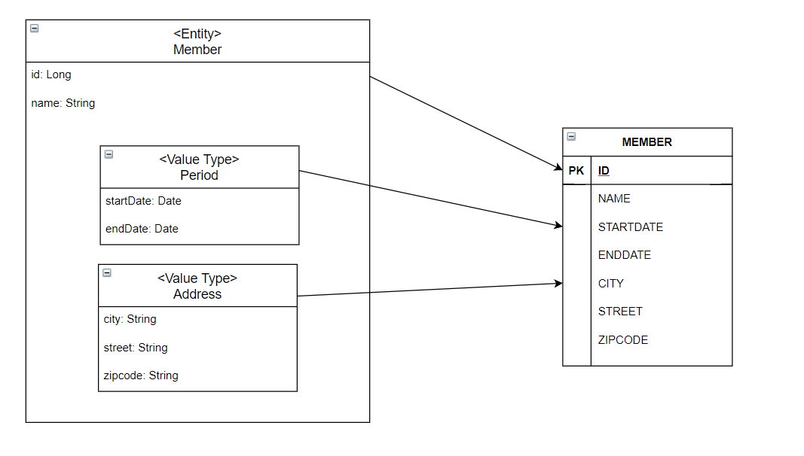
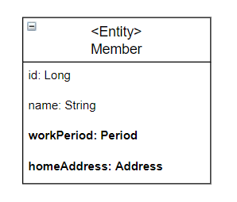
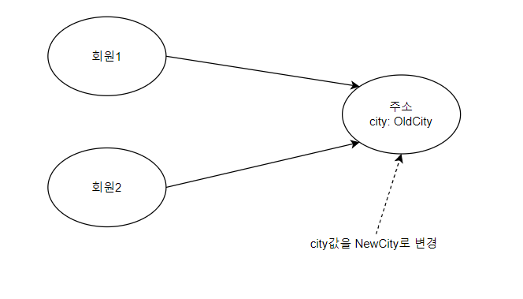
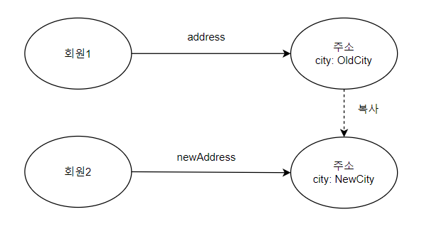

# 9장 값타입

## 목차

- 기본값 타입
- 임베디드 타입
- 값 타입과 불변 객체
- 값 타입의 비교
- 값 타입 컬렉션

## 개요

### 값 타입 종류

- 기본 값 타입
    - 자바 기본 타입(ex, int, double)
    - 래퍼 클래스(ex, Integer)
    - String
- 임베디드 타입(복합 값 타입)
- 컬렉션 값 타입

## 1. 기본값 타입

- 기본 값 타입은 식별자 값도 없고 생명주기도 회원 엔티티에 의존합니다.
- 예를 들어 회원 엔티티를 삭제하면 일반 값 타입도 삭제됩니다.

```java

@Entity
public class Member {

    @Id
    @GeneratedValue
    private Long id;

    // 값 타입 name, age
    private String name;
    private int age;

}
```

## 2. 임베디드 타입

- 임베디드 타입(`Embedded Type`) : 새로운 값 타입을 직접 정의해서 사용하는 타입입니다.
- 임베디드 타입도 하나의 `값 타입`입니다.

```java

@Entity
public class Member {

    @Id
    @GeneratedValue
    private Long id;
    private String name;

    @Embedded
    private Period period;
    @Embedded
    private Address homeAddress;
}

@Embeddable
public class Period {

    @Temporal(TemporalType.DATE)
    private Date startDate;
    @Temporal(TemporalType.DATE)
    private Date endDate;
}

@Embeddable
public class Address {

    @Column(name = "city")
    private String city;
    private String street;
    private String state;
    // ...
}
```

- Member와 Period, Address는 컴포지션 관계입니다.
- Period 클래스는 `Period.isWork()` 처럼 해당 값 타입만 사용하는 의미 있는 메소드도 만들 수 있습니다.

#### 임베디드 타입 사용하기 위한 방법

1. @Embeddable : 값 타입을 정의하는 곳에 표시
2. @Embedded : 값 타입을 사용하는 곳에 표시

#### 임베디드 타입 특징

- 임베디드 타입은 기본 생성자가 필수 입니다.
- 엔티티와 임베디드 타입의 관계는 컴포지션 관계입니다.
    - 컴포지션 관계인 이유는 임베디드 타입을 포함한 모든 값 타입은 엔티티의 생명주기에 의존하기 때문입니다.

### 2.1 임데디드 타입과 테이블 매핑

임베디드 타입을 포함한 회원 엔티티를 데이터베이스 테이블에 매핑한다면 다음과 같을 수 있습니다.



- 임베디드 타입 덕분에 객체와 테이블을 아주 세밀하게 매핑하는 것이 가능합니다.
- 잘 설계한 ORM 애플리케이션은 매핑한 테이블의 수보다 클래스의 수가 더 많습니다.
- ORM을 사용하지 않고 개발하게 되면 테이블 컬럼과 객체 필드를 대부분 1:1로 매핑하게 됩니다.

#### 임베디드 타입과 UML

UML에서 임데디드 값 타입은 아래 그림처럼 기본 타입처럼 단순하게 표현하는 것이 편리합니다.



### 2.2 임베디드 타입과 연관관계

임베디드 타입은 값 타입을 포함하거나 엔티티를 참조할 수 있습니다.

```java

@Entity
public class Member {

    @Embedded
    private Period period;          // 임베디드 타입 포함
    @Embedded
    private Address homeAddress;  // 임데디드 타입 포함
    //...
}

@Embeddable
public class Address {

    private String city;
    private String street;
    private String state;
    @Embedded
    private Zipcode zipcode; // 임베디드 타입 포함
}

@Embeddable
public class Zipcode {

    private String zip;
    private String plusFour;
}

@Embeddable
public class PhonNumber {

    private String areaCode;
    private String localNumber;
    @ManyToOne
    private PhoneServiceProvider provider; // 엔티티 참조
}

@Entity
public class PhoneServiceProvider {

    @Id
    private String name;
    // ...
}
```

- 값 타입인 Address가 값 타입인 zipcode를 포함합니다.
- 값 타입인 PhoneNumber가 엔티티 타입인 PhoneServiceProvider를 참조합니다.

### 2.3 @AttributeOverride : 속성 재정의

임베디드 타입에 정의한 매핑 정보를 재정의하려면 엔티티에 `@AttributeOverride`를 사용하면 됩니다.

```java

@Entity
public class Member {

    // ...
    @Embedded
    Address homeAddress;

    @Embedded
    @AttributeOverrides({
        @AttributeOverride(name = "city", column = @Column(name = "COMPANY_CITY")),
        @AttributeOverride(name = "street", column = @Column(name = "COMPNAY_STREET")),
        @AttributeOverride(name = "state", column = @Column(name = "COMPANY_STATE"))
    })
    private Address companyAddress;
}
```

위 엔티티를 기반으로 생성된 테이블은 다음과 같습니다.

```SQL
CREATE TABLE MEMBER
(
    COMPANY_CITY   varchar(255),
    COMPANY_STREET varchar(255),
    COMPANY_STATE  varchar(255),
    city           varchar(255),
    street         varchar(255),
    zipcode        varchar(255)
)
```

- COMPANY_CITY, COMPANY_STREET, COMPANY_STATE 컬럼은 companyAddress 임베디드 타입 필드 멤버에 대한 컬럼들입니다.
- city, street, zipcode 컬럼은 homeAddress 임베디드 타입 필드 멤버에 대한 컬럼들입니다.

### 2.4 임베디드 타입과 null

임베디드 타입이 `null`이면 매핑한 컬럼 값은 모두 `null`이 됩니다.

```
member.setAddress(null); // null 입력
em.persist(member)
```

데이터베이스에 저장된 Member 테이블에 CITY, STREET, ZIPCODE 컬럼들은 모두 null이 됩니다.

## 3. 값 타입과 불변 객체

### 3.1 값 타입 공유 참조

임베디드 타입 같은 값 타입을 여러 엔티티에서 공유하면 위험합니다.



- 위 그림과 같이 회원1 엔티티와 회원2 엔티티에서 동일한 값 타입인 주소를 참조하고 있습니다.
- 이때 주소 값 타입의 city 값을 "NewCity"로 변경하게 되면 회원1과 회원2 엔티티의 주소도 변경되는 문제가 발생합니다.
- 위와 같은 값 타입 공유 참조 문제를 해결하기 위해서는 값을 복사해서 사용해야 합니다.

### 3.2 값 타입 복사

값 타입의 실제 인스턴스인 값을 공유하는 것은 위험하기 때문에 인스턴스를 복사해서 사용해야 합니다.



- 새로운 city값인 "NewCity" 값을 주소 인스턴스에 설정하기 전에 기존 주소 인스턴스를 복사하여 새로운 값을 설정합니다.

위 그림을 코드로 표현하면 다음과 같습니다.

```
member1.setHomeAddress(new Address("OldCity"));
Address address = member1.getHomeAddress();

// 회원1의 address 값을 활용해서 새로운 newAddress 인스턴스를 생성함
Address newAddress = address.clone();

newAddress.setCity("NewCity");
member2.setHomeAddress(newAddress);
```

- address.clone() 메소드를 통하여 address 인스턴스가 가지 값을 복사하여 값을 복사한 새로운 인스턴스를 반환합니다.
- newAddress.setCity("NewCity") 메소드 호출해도 address 인스턴스의 주소 값이 변하지 않습니다.

### 3.3 불변 객체

불변 객체(Immutable Object) : 값을 수정할 수 없는 객체

불변 객체는 다음과 같이 만들 수 있습니다.

```java

@Embeddable
public class Address {

    private String city;

    protected Address() { // JPA에서 기본 생성자는 필수입니다.

    }

    // 생성자로 초기값을 설정합니다.
    public Address(String city) {
        this.city = city;
    }

    // 접근자는 노출한다.
    public String getCity() {
        return city;
    }

    // 수정자(Setter)는 만들지 않습니다.
}
```

위와 같은 임베디드 값 타입을 이용하여 불변 객체를 사용할 수 있습니다.

```
Address address = member1.getHomeAddress();
// 회원1의 주소값을 조회해서 새로운 주소값을 생성
Address newAddress = new Address(address.getCity());
member2.setHomeAddress(newAddress);
```

## 4. 값 타입의 비교

자바가 제공하는 객체 비교 방법은 2가지입니다.

- 동일성(Identity) 비교 : 인스턴스의 참조 값을 비교, == 사용
- 동등성(Equivalence) 비교 : 인스턴스의 값을 비교, equals() 사용

```
int a = 10;
int b = 10;

Address c = new Address("서울시", "종로구", "1번지");
Address d = new Address("서울시", "종로구", "1번지");

a == b : true
c.equals(d) : true
c == d : false
```

- c == d의 결과가 false가 나온 이유는 인스턴스인 c와 d의 주소값이 다르기 때문입니다.
- c.equals(d)의 결과가 true인 이유는 주소를 비교하는 것이 아닌 내부적으로 가지고 있는 값이 동등한지 판단하기 때문입니다.

## 5. 값 타입 컬렉션

값 타입을 하나 이상 저장하려면 컬렉션에 보관하고 `@ElementCollection`, `@CollectionTable` 애노테이션을 사용하면 됩니다.

```java

@AllArgsConstructor
@NoArgsConstructor
@Getter
@Setter
@Entity
public class Member {

    @Id
    @GeneratedValue
    private Long id;
    private String name;

    @Embedded
    private Address homeAddress;

    @ElementCollection
    @CollectionTable(name = "FAVORITE_FOODS",
        joinColumns = @JoinColumn(name = "MEMBER_ID"))
    @Column(name = "FOOD_NAME")
    private Set<String> favoriteFoods = new HashSet<>();

    @ElementCollection
    @CollectionTable(name = "ADDRESS",
        joinColumns = @JoinColumn(name = "MEMBER_ID"))
    private List<Address> addressHistory = new ArrayList<>();
}

@AllArgsConstructor
@NoArgsConstructor
@Getter
@Embeddable
public class Address {

    @Column
    private String city;
    private String street;
    private String zipcode;
}
```

- favoriteFoods는 기본값 타입인 String을 컬렉션으로 가집니다. 여러개의 String 값들을 데이터베이스 테이블로
  매핑해야 하는데 관계형 데이터베이스의 테이블은 컬럼 안에 컬력션을 포함 할 수 없습니다.
- 컬렉션을 데이터베이스에 넣기 위해서 별도의 테이블을 추가하고 `@CollectionTable`을 사용해서 추가한 테이블을 매핑해야 합니다.
- favoriteFoods 처럼 값으로 사용되는 컬럼이 하나면 @Column을 사용해서 컬럼명을 지정할 수 있습니다.

### 5.1 값 타입 컬렉션 사용

값 타입 컬렉션을 다음과 같이 저장할 수 있습니다.

```
// 임베디드 값 타입
Address address = new Address("서울", "강서", "456-456");
Member member = new Member(null, "김용환", address, new HashSet<>(), new ArrayList<>());
// when
// 기본값 타입 컬렉션
member.getFavoriteFoods().add("짬뽕");
member.getFavoriteFoods().add("짜장");
member.getFavoriteFoods().add("탕수육");
// 임베디드 값 타입 컬렉션
member.getAddressHistory().add(new Address("서울", "강남", "123-123"));
member.getAddressHistory().add(new Address("서울", "강북", "000-000"));

em.persist(member);
```

- 영속성 컨텍스트에 마지막 member 엔티티만 영속화 하였습니다.
- JPA는 이때 member 엔티티의 값 타입도 함께 저장합니다.
- 실제 데이터베이스에 실행하는 총 6개의 INSERT SQL은 다음과 같습니다.
    - member : INSERT SQL 1번
    - member.homeAddress : 컬렉션이 아닌 임베디드 값 타입이므로 회원 테이블을 저장하는 SQL에 포함됩니다.
    - member.favoriteFoods : INSERT SQL 3번
    - member.addressHistory : INSERT SQL 2번

값 타입 컬렉션도 조회할 때 페치 전략을 선택할 수 있습니다. LAZY 전략이 기본입니다.

```
// SQL: SELECT ID, CITY, STREET, ZIPCODE FROM MEMBER WHERE ID = 1
Member member = em.find(Member.class, 1L); // 1. member

// 2. member.homeAddress
Address homeAddress = member.getHomeAddress();

// 3. member.favoriteFoods
Set<String> favoriteFoods = member.getFavoriteFoods(); // LAZY

// SQL: SELECT MEMBER_ID, FOOD_NAME FROM FAVORITE_FOODS WHERE MEMBER_ID = 1
for(String favoriteFood : favoriteFoods){
    System.out.println("favoriteFood = " + favoriteFood);
}

// 4. member.addressHistory
List<Address> addressHistory = member.getAddressHistory(); // LAZY

// SQL: SELECT MEMBER_ID, CITY, STREET, ZIPCODE FROM ADDRESS WHERE MEMBER_ID = 1
addressHistory.get(0);
```

1. member : 회원만 조회합니다. 이때 임베디드 값 타입인 homeAddress도 함께 조회됩니다. SELECT SQL을 1번 호출합니다.
2. member.homeAddress: 1번에서 회원을 조회할 때 같이 조회해 둡니다.
3. member.favoriteFoods : LAZY로 설정해서 실제 컬렉션을 사용할 때 SELECT SQL을 1번 호출합니다.
4. member.addressHistory : LAZY로 설정해서 실제 컬렉션을 사용할 때 SELECT SQL을 1번 호출합니다.

값 타입 컬렉션을 수정할 때 다음과 같이 수행됩니다.

```
// 1. 임베디드 값 타입 수정
member.setHomeAddress(new Address("새로운도시", "신도시1", "123456"));

// 2. 기본값 타입 컬렉션 수정
favoriteFoods = member.getFavoriteFoods();
favoriteFoods.remove("탕수육");
favoriteFoods.add("치킨");

// 3. 임베디드 값 타입 컬렉션 수정
addressHistory = member.getAddressHistory();
addressHistory.remove(new Address("서울", "강남", "123-123"));
addressHistory.add(new Address("새로운도시", "신도시1", "123-456"));
```

1. 임베디드 값 타입 수정 : homeAddress 임베디드 값 타입은 MEMBER 테이블과 매핑했으므로 MEMBER 테이블만 UPDATE합니다.
2. 기본값 타입 컬렉션 수정 : 자바의 String 타입은 수정할 수 없기 때문에 특정 음식명을 수정하기 위해서는 수정하고자 하는
   음식명을 삭제하고 수정할 음식 명을 추가해야 합니다.
3. 임베디드 값 타입 컬렉션 수정 : 값 타입은 불변해야 합니다. 따라서 컬렉션에서 기존 주소를 제거하고 새로운 주소를 등록합니다.

### 5.2 값 타입 컬렉션 제약사항

특정 엔티티 하나에 소속된 값 타입은 변경되어도 자신이 소속된 엔티티를 데이터베이스에서 찾고 값을 변경하면 됩니다.
문제는 **값 타입 컬렉션에 보관된 값 타입들은 별도의 테이블에 보관**됩니다. 따라서 여기에 보관된 값 타입의 값이 변경되면
데이터베이스에 있는 **원본 데이터를 찾기 어렵다는 문제**가 있습니다.

JPA 구현체들은 값 타입 컬렉션에 변경 사항이 발생하면, 값 타입 컬렉션이 매핑된 테이블의 연관된 모든 데이터를 삭제하고,
현재 값 타입 컬렉션 객체에 있는 모든 값을 데이터베이스에 다시 저장한다.

예를 들어 식별자 100번인 회원이 관리하는 주소 값 타입 컬렉션을 변경하면 다음 SQL 같이 테이블에서 회원 100번과 관련된
모든 주소 데이터를 삭제하고 현재 값 타입 컬렉션에 있는 값을 다시 저장합니다.

```
DELETE FROM ADDRESS WHERE MEMBER_ID = 100
INSERT INTO ADDRESS (MEMBER_ID, CITY, STREET, ZIPCODE) VALUES(100, ...)
INSERT INTO ADDRESS (MEMBER_ID, CITY, STREET, ZIPCODE) VALUES(100, ...)
```

실무에서는 값 타입 컬렉션이 매핑된 테이블에 데이터가 많다면 값 타입 컬렉션 대신에 **일대다 관계를 고려**해야 합니다.

- 기본키를 구성해야 하고 기본키 제약 조건으로 NULL을 입력할 수 없게되고 같은 값을 중복해서 저장할 수 없게됩니다.
- 영속성 전이 + 고아 객체 제거 기능을 적용하면 값 타입 컬렉션 처럼 사용할 수 있습니다.

```
@Entity
public class AddressEntity{
  @Id
  @GeneratedValue
  private Long id;
  
  @Embedded
  Address address;
}
```

위 주소 엔티티에 대한 회원 엔티티가 포함하는 AddressEntity 리스트 설정코드는 다음과 같습니다.

```
@OneToMany(cascade = CascadeType.ALL, orphanRemoval = true)
@JoinColumn(name = "MEMBER_ID")
private List<AdressEntity> addressHistory = new ArrayList<>();
```

## 6. 정리

엔티티 타입의 특징

- 식별자(@Id)가 있다.
    - 엔티티 타입은 식별자가 있고 식별자로 구별 할 수 있다.
- 생명 주기가 있다.
    - 생성하고, 영속화하고, 소멸하는 생명 주기가 있다.
    - em.persist(entity)로 영속화합니다.
    - em.remove(entity)로 제거합니다.
- 공유할 수 있습니다.
    - 참조 값을 공유할 수 있습니다. 이것을 `공유 참조`라 합니다.
    - 예를 들어 회원 엔티티가 있다면 다른 엔티티에서 얼마든지 회원 엔티티를 참조할 수 있습니다.

값 타입 특징

- 식별자가 없다
- 생명 주기를 엔티티에 의존합니다.
    - 의존하는 엔티티 제거시 같이 제거됩니다.
- 공유하지 않는 것이 안전합니다.
    - 대신 값을 복사해서 사용해야 합니다.
    - 오직 하나의 주인만이 관리해야 합니다.
    - 불변 객체로 만드는 것이 안전합니다.


