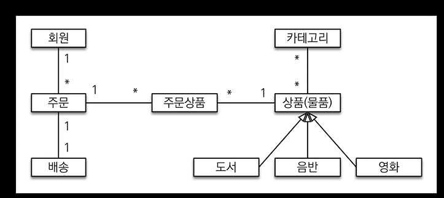
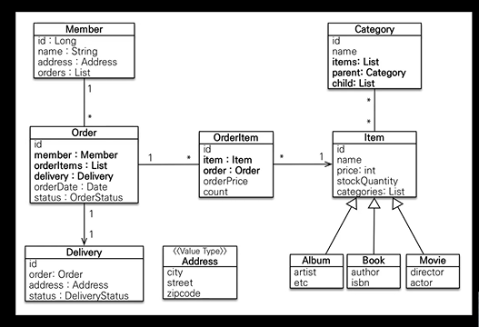
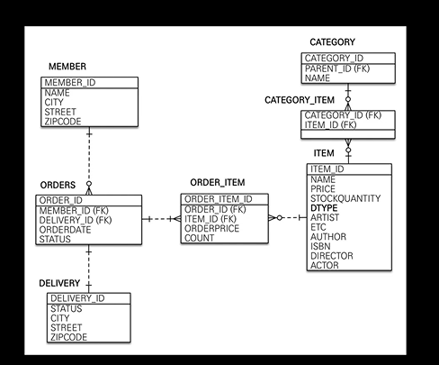
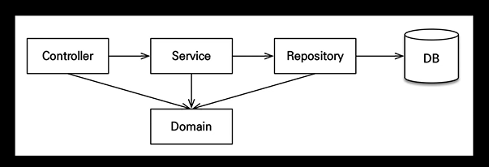
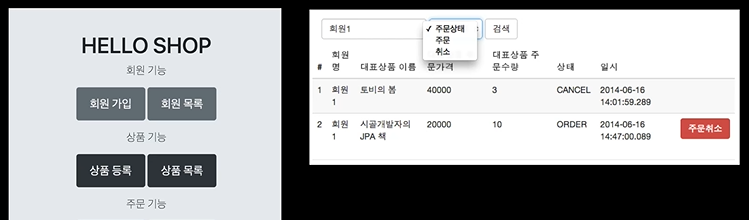

### 프로젝트 환경설정

- Spring Boot
- JPA(Java Persistence API)
- Tomcat
- Gradle
- Hibernate
- Thymeleaf ( View Template)

### 요구사항분석

- 회원기능
    - 회원가입
    - 회원목록
- 상품기능
    - 상품등록
    - 상품목록
- 주문기능
    - 상품주문
    - 주문내역

### 도메인 모델 설계

### 엔티티 설계

### 테이블 설계

### 애플리케이션 아키텍처 구성

### 핵심 비즈니스 로직 개발

- 회원, 상품, 주문 도메인 개발
- 핵심 비즈니스 로직 개발
- 테스트 케이스 검증
- 도메인 주도 설계 이해

### 웹 계층 개발

