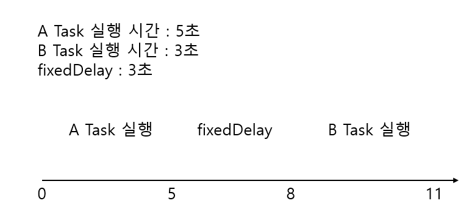

## The @Scheduled Annotation in Spring

### 1. 개요(Overview)

In this tutorial, we'll illustrate how the Spring @Scheduled annotation can be used to configure and schedule tasks.

> 이번 튜토리얼에서는 우리는 스프링 @Scheduled 애노테이션이 어떻게 설정될수 있고 스케줄링할 수 있는지 알아볼 것입니다.

The simple rules that we need to follow to annotate a method with @Scheduled are:

- the method should typically have a void return type (if not, the returned value will be ignored)
- the method should not expect any parameters

> @Scheduled를 가진 메소드는 다음과 같은 규칙을 따라야 합니다.
> - 메소드는 void 타입을 가져야 합니다. 만약 리턴 타입이 있다면 무시 될 것입니다.
> - 메소드는 어떤 매개변수도 가지지 않습니다.

### 2. 스케줄링 지원 사용(Enable Support for Scheduling)

To enable support for scheduling tasks and the @Scheduled annotation in Spring, we can use the Java enable-style
annotation:

> 스프링에서 @Scheduled 애노테이션과 스케줄링 테스크를 지원하기 위해서는 Java 활성화 애노테이션을 사용할 수 있습니다.

```java

@Configuration
@EnableScheduling
public class SpringConfig {
    //...
}
```

Conversely, we can do the same in XML:

> 반대로 XML에서는 다음과 같이 사용할 수 있습니다.

```xml

<task:annotation-driven/>
```

### 3. Fixed Delay로 테스크 스케줄링하기(Schedule a Task at Fixed Delay)

Let's start by configuring a task to run after a fixed delay:

> fixed delay 후에 실행하는 테스크를 설정하는 것을 실행해봅시다.

```java

@Configuration
@EnableScheduling
public class SpringConfig {
    @Scheduled(fixedDelay = 5000)
    public void scheduleFixedDelayTask() {
        System.out.println("Fixed delay task - " + System.currentTimeMillis() / 1000);
    }
}
```

In this case, the duration between the end of the last execution and the start of the next execution is fixed. The task
always waits until the previous one is finished.

> 이 경우에는 마지막 실행이 종료되고 다음 실행이 시작될 때까지의 기간(duration)이 고정적입니다.
> 테스크는 언제나 이전 테스크가 끝날때까지 대기합니다.

This option should be used when it’s mandatory that the previous execution is completed before running again.

> 이 fixedDelay 옵션의 경우 이전 실행이 다시 실행하기 전까지 완료되야 할때 사용됩니다.

### 4. Fixed Rate로 테스크 스케줄링하기(Schedule a Task at a Fixed Rate)

Let's now execute a task at a fixed interval of time:

> fixed 간격의 시간으로 테스크를 실행해봅시다.

```java

@Configuration
@EnableScheduling
public class SpringConfig {
    @Scheduled(fixedDelay = 5000)
    public void scheduleFixedDelayTask() {
        System.out.println("Fixed delay task - " + System.currentTimeMillis() / 1000);
    }
}
```

This option should be used when each execution of the task is independent.

> 이 옵션은 각각의 테스크 실행이 독립적일때 사용됩니다.

Note that scheduled tasks don't run in parallel by default. So even if we used fixedRate, the next task won't be invoked
until the previous one is done.

> 스케줄링된 테스크들은 기본적으로 병렬적으로 수행되지 않습니다.
> 따라서 fixedRate 옵션을 사용하더라도 앞의 테스크가 끝날때까지 다음 작업은 실행되지 않습니다.

If we want to support parallel behavior in scheduled tasks, we need to add the @Async annotation:

> 만약 우리가 스케줄링된 테스크에 병렬적 실행을 원한다면 우리는 @Async 애노테이션을 추가할 필요가 있습니다.

```java

@Configuration
@EnableAsync
public class ScheduledFixedRateExample {
    @Async
    @Scheduled(fixedRate = 1000)
    public void scheduleFixedRateTaskAsync() throws InterruptedException {
        System.out.println("Fixed rate task async - " + System.currentTimeMillis() / 1000);
        Thread.sleep(2000); // 비동기로 작동하기 때문에 2초간 쉬어도 다른 쓰레드로 1초마다 실행됩니다.
    }
}
```

Now this asynchronous task will be invoked each second, even if the previous task isn't done.

> 이 비동기 테스크는 이전 테스크가 슬립하는 동안에도 매초 실행될 것입니다.

### 5. Fixed Rate vs Fixed Delay

We can run a scheduled task using Spring's @Scheduled annotation, but based on the properties fixedDelay and fixedRate,
the nature of execution changes.

> 우리는 스프링의 @Scheduled 애노테이션을 사용하여 스케줄링된 테스크를 수행시킬 수 있었습니다.
> 그러나 fixedDelay와 fixedRate 속성에 기반하여 실행 방식이 달라집니다.

**The fixedDelay property makes sure that there is a delay of n millisecond between the finish time of an execution of a
task and the start time of the next execution of the task.**

> fixedDelay 속성은 실행의 마지막 시간과 다음 실행의 시작 시간 차이에 n 밀리세컨드의 딜레이가 있는 것입니다.
> 예를 들어 fixedDelay가 3초이고 A 테스크와 B 테스크가 있다고 가정하면 A 테스크가 실행을 종료하고 3초 후에 B 테스크가 수행되는 것입니다.



This property is specifically useful when we need to make sure that only one instance of the task runs all the time. For
dependent jobs, it is quite helpful.

> fixedDelay 속성은 테스크의 인스턴스를 항상 하나만 실행할때 특히 유용합니다. 의존적인 작업의 경우 꽤 도움이 됩니다.

The fixedRate property runs the scheduled task at every n millisecond. It doesn't check for any previous executions of
the task.

> fixedRate 속성은 매 n 밀리초마다 스케줄링된 테스크를 실행합니다.
> fixedRate 속성은 테스크의 이전 실행을 체크하지 않습니다.

This is useful when all executions of the task are independent. If we don't expect to exceed the size of the memory and
the thread pool, fixedRate should be quite handy.

> fixedRate 속성은 모든 테스크의 실행이 독립적일때 유용합니다.
> 만약 메모리의 크기를 초과하지 않을 것으로 예상되면 스레드 풀, fixedRate 속성은 매우 유용할 것입니다.

Although, if the incoming tasks do not finish quickly, it's possible they end up with “Out of Memory exception”.

> 그러나 들어오는 테스크가 빨리 완료도지ㅣ 않으면 "메모리 부족 예외"로 끝날 수 있습니다.

### 6. 초기 딜레이를 가진 상태에서 테스크를 스케줄링하기(Schedule a Task With Initial Delay)

Next, let's schedule a task with a delay (in milliseconds):

> 다음으로 밀리초 단위의 딜레이를 가진 테스크를 스케줄링해봅시다.

```java

@Configuration
@EnableScheduling
public class SpringConfig {

    @Scheduled(fixedDelay = 1000, initialDelay = 3000)
    public void scheduleFixedRateWithInitialDelayTask() {
        System.out.println("Fixed rate task with one second initial delay - " + System.currentTimeMillis() / 1000);
    }
}
```

Note how we're using both fixedDelay as well as initialDelay in this example. The task will be executed the first time
after the initialDelay value, and it will continue to be executed according to the fixedDelay.

> 이 예제에서는initialDelay 뿐만 아니라 fixedDelay 둘다 사용하고 있습니다.
> 테스크는 첫번째 initialDelay 값에 설정된 시간이 지난후에 실행될 것입니다.
> 그리고 테스크는 그 이후부터 fixedDelay 속성에 따른 값에 따라서 실행을 계속할 것입니다.
> 예를 들어 위의 예제의 경우 3초가 지난후에 한번 실행되고 그 이후부터는 1초마다 실행됩니다.

This option is convenient when the task has a setup that needs to be completed.

> 이 옵션은 테스크에 완료되어야 하는 설정이 있을때 편리합니다.

### 7. Cron 표현식을 사용하여 테스크 스케줄링하기(Schedule a Task Using Cron Expressions)

Sometimes delays and rates are not enough, and we need the flexibility of a cron expression to control the schedule of
our tasks:

> 가끔씩 delay와 rate로는 충분치 않습니다. 우리는 우리의 테스크의 스케줄링을 제어하기 위해서 cron 표현식의 유연성이 필요합니다.

```java

@Configuration
@EnableScheduling
public class SpringConfig {
    // 매월 15일 10시 15분마다 실행합니다.
    @Scheduled(cron = "0 15 10 15 * ?")
    public void scheduleTaskUsingCronExpression() {
        System.out.println("schedule tasks using cron jobs - " + LocalDateTime.now());
    }
}
```

Note that in this example, we're scheduling a task to be executed at 10:15 AM on the 15th day of every month.

> 이 예제에서는 매월 15일 오전 10시 15분에 테스크가 실행되도록 스케줄링하고 있습니다.

By default, Spring will use the server's local time zone for the cron expression. However, we can use the zone attribute
to change this timezone:

> 기본적으로 스프링은 cron 표현식에 대하여 서버의 로컬 타임 존을 사용할 것입니다. 그러나 우리는 timezone을 변경하기 위해서 zone 속성을 사용할 수 있습니다.

```
@Scheduled(cron = "0 15 10 15 * ?", zone = "Europe/Paris")
```

With this configuration, Spring will schedule the annotated method to run at 10:15 AM on the 15th day of every month in
Paris time.

> 이 설정을 가지고 스프링은 파리 시간으로 매월 15일 오전 10시 15분에 애노테이션된 메소드를 스케줄링할 것입니다.

### 8. 스케줄링 파라미터(Parameterizing the Schedule)

Hardcoding these schedules is simple, but we usually need to be able to control the schedule without re-compiling and
re-deploying the entire app.

> 이러한 스케줄들을 하드코딩하는 것은 간단합니다. 그러나 우리는 보통 전체적인 앱을 재컴파일과 재배포없이 스케줄을 제어가 가능하는 것이 필요합니다.

We'll make use of Spring Expressions to externalize the configuration of the tasks, and we'll store these in properties
files.

> 우리는 테스크의 설정을 외부화하기 위하여 스프링 표현식을 사용할 수 있습니다. 그리고 우리는 이 표현식들을 properties 파일에 저장할 것입니다.

A fixedDelay task:

```
@Scheduled(fixedDelayString = "${fixedDelay.in.milliseconds}")
```

A fixedRate task:

```
@Scheduled(fixedRateString = "${fixedRate.in.milliseconds}")
```

A cron expression based task:

```
@Scheduled(cron = "${cron.expression}")
```

예를 들어 application.properties 파일에 다음과 같이 설정할 수 있습니다.

```properties
fixedDelay.in.milliseconds=5000
fixedRate.in.milliseconds=5000
cron.expression=0/3 * * * * *
```

### 10. 런타임에 동적으로 Delay 또는 Rate 설정하기(Setting Delay or Rate Dynamically at Runtime)

Normally, all the properties of the @Scheduled annotation are resolved and initialized only once at Spring context
startup.

> 보통 @Scheduled 애노테이션의 속성들은 스프링 컨텍스트 시작 시점에 초기화됩니다.

Therefore, changing the fixedDelay or fixedRate values at runtime isn't possible when we use @Scheduled annotation in
Spring.

> 그러므로, 런타임 시점에 fixedDelay나 fixedRate 값 변경은 우리가 @Scheduled 애노테이션을 스프링에서 사용할때는 불가능합니다.

However, there is a workaround. Using Spring's SchedulingConfigurer provides a more customizable way to give us the
opportunity of setting the delay or rate dynamically.

> 그러나, 해결방법이 있습니다. 스프링의 `SchedulingConfigurer`을 사용하는 방법은 delay나 rate를 동적으로 설정할 수 있는 우리에게 더욱 사용자 지정 가능한 방법을 제공합니다.

Let's create a Spring configuration, DynamicSchedulingConfig, and implement the SchedulingConfigurer interface:

> SchedulingConfigurer 인터페이스를 구현한 DynamicSchedulingConfig 설정 클래스를 생성해봅시다.

```java

@Configuration
@EnableScheduling
public class DynamicSchedulingConfig implements SchedulingConfigurer {

    @Autowired
    private TickService tickService;

    @Bean
    public Executor taskExecutor() {
        return Executors.newSingleThreadScheduledExecutor();
    }

    @Override
    public void configureTasks(ScheduledTaskRegistrar taskRegistrar) {
        taskRegistrar.setScheduler(taskExecutor());
        taskRegistrar.addTriggerTask(
                new Runnable() {
                    @Override
                    public void run() {
                        tickService.tick();
                    }
                },
                new Trigger() {
                    @Override
                    public Date nextExecutionTime(TriggerContext context) {
                        Optional<Date> lastCompletionTime =
                                Optional.ofNullable(context.lastCompletionTime());
                        Instant nextExecutionTime =
                                lastCompletionTime.orElseGet(Date::new).toInstant()
                                        .plusMillis(tickService.getDelay());
                        return Date.from(nextExecutionTime);
                    }
                }
        );
    }

}
```

As we notice, with the help of the ScheduledTaskRegistrar#addTriggerTask method, we can add a Runnable task and a
Trigger implementation to recalculate the nextExecutionTime after the end of each execution.

> ScheduledTaskRegistrar 객체의 addTriggerTask 메소드의 도움을 받아 Runnable 테스크와 Trigger 구현체를 추가하여 각 실행의 종료 이후에 다음 실행시간을 다시 계산할 수
> 있도록 합니다.

Additionally, we annotate our DynamicSchedulingConfig with @EnableScheduling to make the scheduling work.

> 추가적으로 우리는 스케줄링이 작동하도록 @EnableScheduling을 사용하여 DynamicSchedulingConfig 클래스에 애노테이션을 달았습니다.

As a result, we scheduled the TickService#tick method to run it after each amount of delay, which is determined
dynamically at runtime by the getDelay method.

> 결과대로 우리는 getDelay 메소드에 의해서 런타임 시점에 동적으로 정해진 delay 값만큼 시간이 지난후에 실행하는 TrickService 객체의 tick 메소드를 스케줄링하였습니다.

### 11. 병렬적으로 테스크를 실행하기(Running Tasks in Parallel)

By default, Spring uses a local single-threaded scheduler to run the tasks. As a result, even if we have multiple
@Scheduled methods, they each need to wait for the thread to complete executing a previous task.

> 기본적으로 스프링은 테스크를 실행하기 위해서 로컬한 싱글 스레드 스케줄러를 사용합니다.
> 결과적으로 우리가 @Scheduled 메소드들이 여러개 가지고 있음에도 불구하고 스케줄링 메소드들은 이전 테스크의 실행 완료에 대한 각각 대기가 필요합니다.

If our tasks are truly independent, it's more convenient to run them in parallel. For that, we need to provide a
TaskScheduler that better suits our needs:

> 만약 우리의 테스크들이 진정 독립적이라면, 테스크들이 병렬로 실행하는 것이 더욱 편리합니다.
> 그러기 위해서는 우리는 다음과 같은 요구사항에 더 적합한 작업 스케줄러를 제공해야 합니다.

```
@Bean
public TaskScheduler  taskScheduler() {
    ThreadPoolTaskScheduler threadPoolTaskScheduler = new ThreadPoolTaskScheduler();
    threadPoolTaskScheduler.setPoolSize(5);
    threadPoolTaskScheduler.setThreadNamePrefix("ThreadPoolTaskScheduler");
    return threadPoolTaskScheduler;
}
```

In the above example, we configured the TaskScheduler with a pool size of five, but keep in mind that the actual
configuration should be fine-tuned to one's specific needs.

> 위 예제와 같이 우리는 TaskScheduler의 풀 사이즈를 5로 설정하였습니다. 그러나 명시하세요. 실제 설정은 자신의 특정 요구에 맞게 미세 조정이 되어야 합니다.

### 11.1. 스프링 부트 사용하기(Using Spring Boot)

If we use Spring Boot, we can make use of an even more convenient approach to increase the scheduler's pool size.

> 만약 스프링부트를 사용한다면 우리는 스케줄러의 풀 사이즈를 증가하기 위해서 더욱 편리한 방법을 사용할 수 있습니다.

It's simply enough to set the spring.task.scheduling.pool.size property:

> spring.task.scheduling.pool.size 속성을 다음과 같이 간단한게 설정할 수 있습니다.

```properties
spring.task.scheduling.pool.size=5
```

### 12. 결론(Conclusion)

In this article, we discussed the way to configure and use the @Scheduled annotation.

> 이번 장에서 우리는 @Scheduled 애노테이션을 사용하고 설정하는 방법에 대해서 알아보았습니다.

We covered the process to enable scheduling, and various ways of configuring scheduling task patterns. We also showed a
workaround to configure the delay and rate dynamically.

> 스케줄링을 활성화하는 프로세스와 스케줄링 작업 패턴을 구성하는 다양한 방법에 대해서 설명하였습니다. 또한 delay 및 rate를 동적으로 구성하기 위한 해결 방법을 보여줬습니다.

### References

- [The @Scheduled Annotation in Spring](https://www.baeldung.com/spring-scheduled-tasks)
