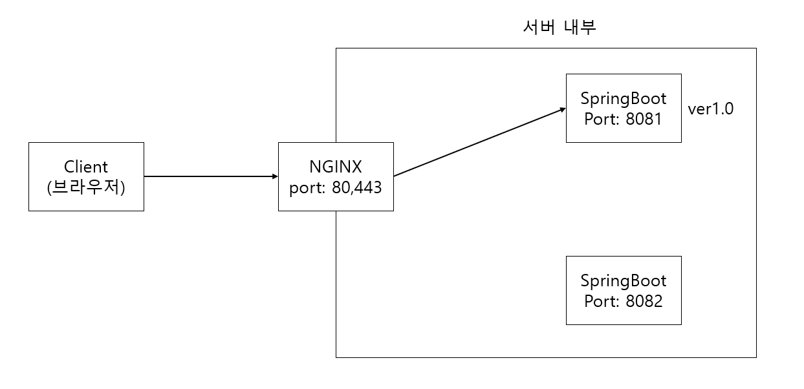
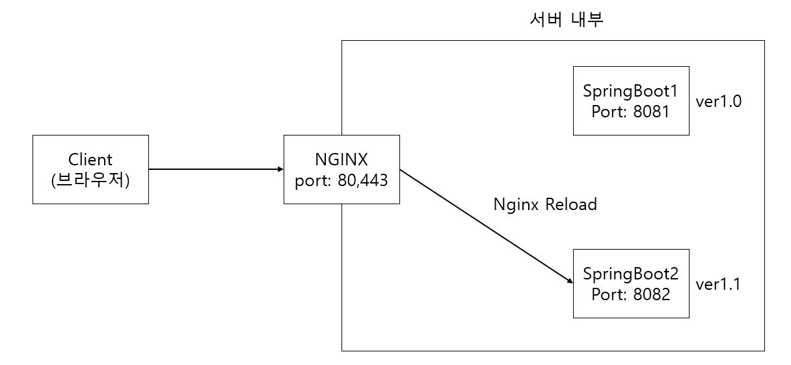
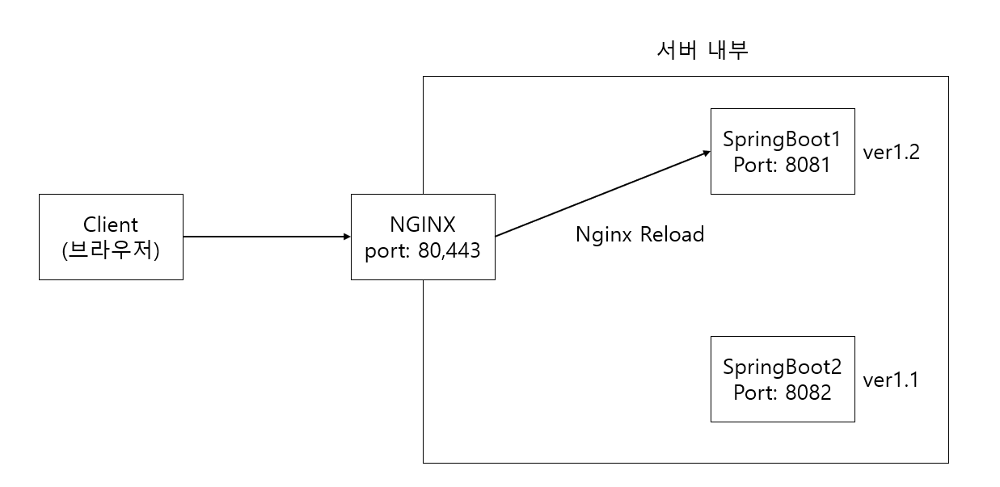
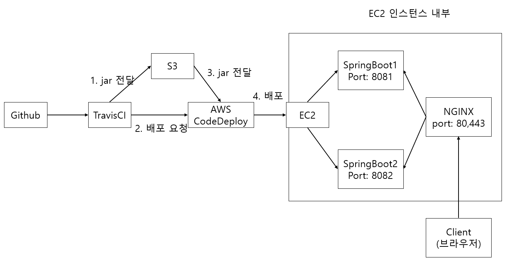
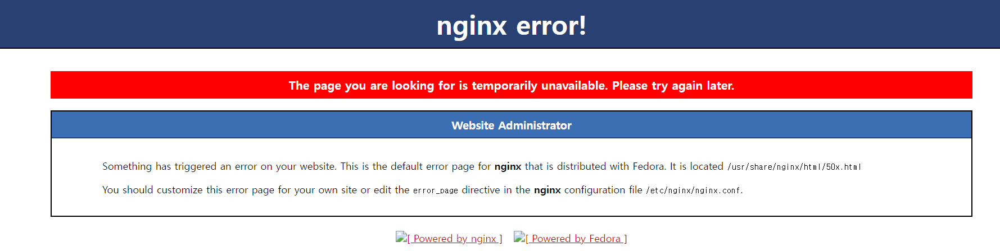
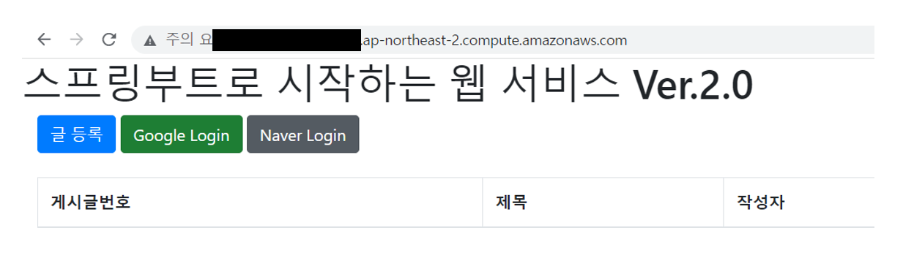
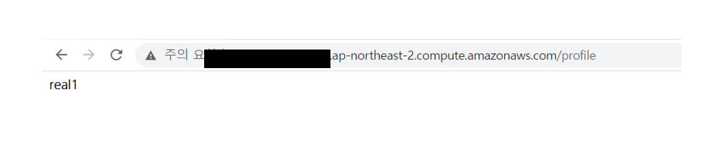
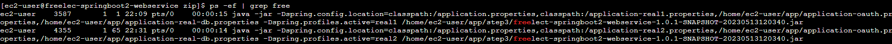

# 24시간 365일 중단 없는 서비스를 만들자

## 목차

## 무중단 배포 소개

무중단 배포 방식 일부 방법

- AWS에서 블루 그린 무중단 배포
- 도커를 이용한 웹 서비스 무중단 배포

엔진엑스(Nginx)

- 웹서버, 리버스 프록시, 캐싱, 로드 밸런싱, 미디어 스트리밍 등을 위한 오픈소스 소프트웨어
- 리버스 프록시
    - 엔진엑스가 외부의 요청을 받아서 백엔드 서버로 요청을 전달하는 행위
    - 클라이언트가 서버를 호출할 때 리버스 프록시를 호출하게 되면 프록시 서버가 서버를 요청하여 받은 응답을 클라이언트에게 전달하는 방식
    - 용도 : 로드 밸런싱, 무중단 배포, 디도스 등으로부터 보호, SSL 암호화, 캐싱
- 리버스 프록시를 통해서 무중단 배포 환경을 구축할 수 있습니다.
- AWS와 같은 클라우드 인프라가 구축되어 있지 않아도 사용할 수 있는 방법
    - 개인 서버에서도 가능합니다.

엔진엑스 무중단 배포 1


운영 과정은 다음과 같습니다.

1. 사용자는 서비스 주소로 접속합니다.(80 혹은 443 포트)
2. 엔진엑스는 사용자의 요청을 받아 현재 연결된 스프링 부트로 요청을 전달합니다.
    - 스프링 부트1 즉, 8081 포트로 요청을 전달한다고 가정합니다.
3. 스프링부트2는 엔진엑스와 연결된 상태가 아니니 요청받지 못합니다.

엔진엑스 무중단 배포 2



1. 배포하는 동안에도 서비스는 중단되지 않습니다.
    - 엔진엑스는 스프링 부트1을 바라보기 때문입니다.
2. 배포가 끝나고 정상적으로 스프링 부트2가 구동 중인지 확인합니다.
3. 스프링 부트2가 정상 구동 중이면 nginx reload 명령어를 통해 8081 대신 8082를 바라보도록 합니다.
4. nginx reload는 0.1 이내에 완료됩니다.

엔진엑스 무중단 배포 3


1. 현재는 엔진엑스와 연결된 것이 스프링 부트 2입니다.
2. 스프링 부트 1의 배포가 끝나면 엔진엑스가 스프링 부트1을 바라보도록 변경하고 nginx reload를 실행합니다.
3. 이후 요청부터는 엔진엑스가 스프링 부트 1로 요청을 전달합니다.

무중단 배포 전체 구조


## 엔진엑스 설치와 스프링 부트 연동하기

엔진엑스 설치

```
$ sudo yum install nginx # nginx 설치
$ sudo service nginx start # nginx 시작
```

보안그룹 추가

- 엔진엑스의 포트번호는 기본적으로 80번이기 때문에 EC2의 보안그룹에 80번 포트를 추가합니다.


리다이렉션 주소 추가

- 구글 승인된 리다이렉션 URI 추가
    - 구글 클라우드 -> API 및 서비스 -> 사용자 인증 정보 -> 승인된 리다이렉션 URI 추가
    - URI 추가 값은 : http://{EC2 인스턴스 퍼블릭 IPv4 DNS 주소}/login/oauth2/code/google
    - 기존 추가 값의 8080 포트만 제거한 형태로 추가합니다. HTTP 기본 포트가 80번이기 때문에 생략이 가능합니다.
- 네이버 승인된 리다이렉션 URI 추가
    - 네비어 API -> 내 애플리케이션 -> 애플리케이션 선택 -> API 설정 -> 로그인 오픈 API 서비스 환경 -> 네이버 로그인 -> 승인된 리다이렉션 URI 추가
    - URI 추가 값은 : http://{EC2 인스턴스 퍼블릭 IPv4 DNS 주소}/login/oauth2/code/naver

- http://{EC2 인스턴스 퍼블릭 IPv4 DNS 주소}/ 요청하여 Nginx 페이지가 보이는지 확인



엔진엑스와 스프링 부트 연동
엔진엑스가 현재 실행 중인 스프링 부트 프로젝트를 바라보도록 프록시 설정을 합니다.

1. 엔진엑스 설정 파일 열기

```
$ sudo vim /etc/nginx/nginx.conf
```

- server 아래 location / 부분에 다음과 같이 추가합니다.

```
        location / {
                proxy_pass http://localhost:8080;
                proxy_set_header X-Real-IP $remote_addr;
                proxy_set_header X-Forwarded-For $proxy_add_x_forwarded_for;
                proxy_set_header Host $http_host;
        }
```

- proxy_pass : 엔진엑스 요청이 오면 http://localhost:8080로 전달합니다.
- proxy_set_header
    - 실제 요청 데이터를 header의 각 항목에 할당합니다.
    - ex) proxy_set_header X-Real-IP $remote_addr : Request Header의 X-Real-IP에 요청자의 IP를 저장합니다.
    - X-Real-IP : 클라이언트의 실제 IP 주소를 Nginx 서버로 전달하기 위해 사용됩니다.
    - X-Forwarded-For : 클라이언트와 Nginx를 거치는 모든 프록시 서버의 IP 주소 목록을 포함하는 헤더입니다.
    - Host : HTTP 요청에서 호스트 이름을 나타내는 헤더입니다. 클라이언트가 요청하는 도메인 이름이나 IP주소가 Host 헤더에 포함됩니다.

2. 엔진엑스 재시작

```
$ sudo service nginx restart
```

3. 스프링 부트 연동 완료
   

## 무중단 배포 스크립트 만들기

### profile API 추가

profile API를 만들어 배포시에 8081을 쓸지 8082를 쓸지 판단하는데 사용합니다.

```java
package com.jojoldu.book.springboot.web;

import java.util.Arrays;
import java.util.List;
import lombok.RequiredArgsConstructor;
import org.springframework.core.env.Environment;
import org.springframework.web.bind.annotation.GetMapping;
import org.springframework.web.bind.annotation.RestController;

@RequiredArgsConstructor
@RestController
public class ProfileController {

    private final Environment env;

    @GetMapping("/profile")
    public String profile() {
        List<String> profiles = Arrays.asList(env.getActiveProfiles());
        List<String> realProfiles = Arrays.asList("real", "real1", "real2");
        String defaultProfile = profiles.isEmpty() ? "default" : profiles.get(0);

        return profiles.stream()
            .filter(realProfiles::contains)
            .findAny()
            .orElse(defaultProfile);
    }
}

```

/profile API 호출이 인증없이도 호출될 수 있게 SecurityConfig 클래스에 제외 코드를 추가합니다.

```
.antMatchers("/", "/css/**", "/images/**", "/js/**", "/h2-console/**", "/profile")
.permitAll()
```

브라우저에서 /profile로 접속해서 현재 profile이 무엇인지 확인할 수 있으면 성공입니다.



### real1, real2 profile 생성

applicatoin-real1.properties

```
server.port=8081
spring.profiles.active=oauth,real-db
spring.jpa.properties.hibernate.dialect=org.hibernate.dialect.MySQL5InnoDBDialect
spring.session.store-type=jdbc
```

applicatoin-real2.properties

```
server.port=8082
spring.profiles.active=oauth,real-db
spring.jpa.properties.hibernate.dialect=org.hibernate.dialect.MySQL5InnoDBDialect
spring.session.store-type=jdbc
```

### 엔진엑스 설정 수정

- 엔진엑스 설정은 무중단 배포의 핵심입니다.
- 배포 때마다 엔진엑스의 프록시 설정(스프링 부트로 요청을 흘러보내는)이 순식간에 교체됩니다.
- 여기서 프록시 설정이 교체될 수 있도록 설정을 추가합니다.

1. 엔진엑스 설정이 모여있는 /etc/nginx/conf.d/에 service-url.ink 파일을 생성합니다.

```
$ sudo vim /etc/nginx/conf.d/service-url.inc
```

2. 다음 코드를 입력합니다.

```
set $service_url http://127.0.0.1:8080;
```

3. nginx.conf 파일 수정하여 proxy_pass에 $service_url을 설정합니다.

```
$ sudo vim /etc/nginx/nginx.conf
```

- server 아래 location / 부분에 다음과 같이 추가합니다.

```
include /etc/nginx/conf.d/service-url.inc;

        location / {
                proxy_pass $service_url;
                proxy_set_header X-Real-IP $remote_addr;
                proxy_set_header X-Forwarded-For $proxy_add_x_forwarded_for;
                proxy_set_header Host $http_host;
        }
```

4. nginx 서비스 재시작
```
$ sudo service nginx restart
```

### 배포 스크리븥 작성
1. EC2 인스턴스에 step3 디렉토리 생성
```
$ mkdir ~/app/step3 && mkdir ~/app/step3/zip
```

4. 프로젝트에 appspec.yml 파일에 step3로 배포되도록 수정합니다.
```
version: 0.0
# CodeDeploy 버전을 이야기합니다.
# 프로젝트 버전이 아니므로 0.0 외에 다른 버전을 사용하면 오류가 발생합니다.
os: linux
files:
  - source: /
    # CodeDeploy에서 전달해 준 파일 중 destination으로 이동시킬 대상을 지정합니다.
    # 루트 경로(/)를 지정하면 전체 파일을 이야기합니다.
    destination: /home/ec2-user/app/step3/zip/
    # source에서 지정된 파일을 받을 위치입니다.
    # 이후 Jar를 실행하는 등은 destination에서 옮긴 파일들로 진행됩니다.
    overwrite: yes
    # 기존에 파일들이 있으면 덮어쓸지 결정합니다.
```

무중단 배포를 진행할 스크립트들은 총 5개입니다.
- stop.sh : 기존 엔진엑스에 연결되어 있지는 않지만, 실행중이던 스프링 부트 종료
- start.sh : 배포할 신규 버전 스프링 부트 프로젝트를 stop.sh로 종료한 'profile'로 실행
- health.sh : 'start.sh'로 실행시킨 프로젝트가 정상적으로 실행됬는지 체크
- switch.sh : 엔진엑스가 바라보는 스프링 부트를 최신 버전으로 변경
- profile.sh : 앞선 4개 스크립트 파일에서 공용으로 사용할 'profile'과 포트 체크 로직

5. appspec.yml 파일에 앞선 스크립트를 사용하도록 설정합니다.
```
permissions:
  - object: /
    pattern: "**"
    owner: ec2-user
    group: ec2-user

hooks:
  # 애플리케이션 배포 과정에서 다양한 단계에서 실행될 수 있는 작업들을 정의하는 섹션
  AfterInstall:
    - location: stop.sh # nginx와 연결되어 있지 않은 스프링 부트를 종료합니다.
      timeout: 60
      runas: ec2-user
  ApplicationStart:
    - location: start.sh # nginx와 연결되어 있지 않은 Port로 새 버전의 스프링 부트를 시작합니다.
      timeout: 60
      runas: ec2-user
  ValidateService:
    - location: health.sh # 새 프링부트가 정상적으로 실행됬는지 확인합니다.
      timeout: 60
      runas: ec2-user
```

6. 앞선 5개의 스크립트 파일을 작성합니다.
profile.sh

```
#!/usr/bin/env bash

# 쉬고 있는 profile 찾기 : real1이 사용중이면 real2가 쉬고 있고, 반대편 real1이 쉬고 있음

function find_idle_profile() {
  RESPONSE_CODE=$(curl -s -o /dev/null -w "%{http_code}" http://localhost/profile)
  # 현재 nginx가 바라보고 있는 스프링부트가 정상적으로 수행중인지 확인합니다.
  # 응답값을 HttpStatus로 받습니다.
  # 정상이면 200, 오류가 발생한다면 400~503 사이로 발생하니 400 이상은 모두 예외로 보고 real2를 현재 profile로 사용합니다.
  # curl -s : slient 모드를 의미합니다. curl이 작업하는 동안 출력되는 메시지를 표시하지 않습니다.
  # curl -o {경로} : curl 출력을 {경로}로 보냅니다. 예를 들어 curl -o /dev/null이면 /dev/null로 curl 출력을 보냅니다.
  # 이 옵션은 응답 데이터를 무시하고 요청이 성공했는지 여부만 확인하려는 경우 유용합니다.
  # curl -w {출력형식} : curl의 출력 형식을 지정합니다.

  if [ ${RESPONSE_CODE} -ge 400 ]; then # 400 보다 큰 경우
    CURRENT_PROFILE=real2
  else
    CURRENT_PROFILE=$(curl -s http://localhost/profile)
  fi

  if [ ${CURRENT_PROFILE} == real1 ]; then
    IDLE_PROFILE=real2 # nginx와 연결되어 있지 않은 profile입니다.
    # 스프링부트 프로젝트를 이 profile로 연결하기 위해 반환합니다.
  else
    IDLE_PROFILE=real1
  fi

  echo "${IDLE_PROFILE}"
  # bash 스크립트는 값을 반환하는 기능이 없습니다.
  # 그래서 제일 마지막 줄에 echo로 결과를 출력 후, 클라이언트에서 그 값을 잡아서 ($(find_idle_profile)) 사용합니다.
}

# 쉬고 있는 profile의 port 찾기
function find_idle_port() {
  IDLE_PROFILE=$(find_idle_profile)

  if [ ${IDLE_PROFILE} == real1 ]; then
    echo "8081"
  else
    echo "8082"
  fi
}

```

stop.sh

```
#!/usr/bin/env bash

ABSPATH=$(readlink -f $0)
# readlink : 심볼릭 링크를 따라가면서 해당 파일의 실제 경로를 반환합니다.
# -f : 반환되는 경로를 절대 경로로 반환하도록 지정합니다.
# $0 : 현재 스크립트 파일 또는 셸 스크립트 파일의 이름을 나타냅니다.

ABSDIR=$(dirname $ABSPATH)
# 현재 stop.sh가 속해있는 경로를 찾습니다.
# 하단의 코드와 같이 profile.sh의 경로를 찾기 위해 사용됩니다.
source ${ABSDIR}/profile.sh
# 자바로 치면 일종의 import 구문
# 해당 코드로 인해 stop.sh에서도 profile.sh의 여러 function을 사용할 수 있게 됩니다.

if [ -z ${IDLE_PID} ]; then
  echo "> 현재 구동 중인 애플리케이션이 없으므로 종료하지 않습니다."
else
  echo "> kill -15 $IDLE_PID"
  kill -15 ${IDLE_PID}
  sleep 5
fi
```

start.sh

```
#!/usr/bin/env bash

ABSPATH=$(readlink -f $0)
ABSDIR=$(dirname $ABSPATH)
source ${ABSDIR}/profile.sh

REPOSITORY=/home/ec2-user/app/step3
PROJECT_NAME=freelec-springboot2-webservice

echo "> Build 파일 복사"
echo "> cp $REPOSITORY/zip/*.jar $REPOSITORY/"

cp $REPOSITORY/zip/*.jar $REPOSITORY/

echo "> 새 애플리케이션 배포"
JAR_NAME=$(ls -tr $REPOSITORY/*.jar | tail -n 1)

echo "> JAR_NAME: $JAR_NAME"
echo "> $JAR_NAME 에 실행권한 추가"
chmod +x $JAR_NAME

echo "> $JAR_NAME 실행"

IDLE_PROFILE=$(find_idle_profile)

echo "> $JAR_NAME 를 profile=$IDLE_PROFILE 로 실행합니다."
nohup java -jar \
  -Dspring.config.location=classpath:/application.properties,classpath:/application-$IDLE_PROFILE.properties,/home/ec2-user/app/application-oauth.properties,/home/ec2-user/app/application-real-db.properties \
  -Dspring.profiles.active=$IDLE_PROFILE \
  $JAR_NAME >$REPOSITORY/nohup.out 2>&1 &
```

health.sh

```
#!/usr/bin/env bash

ABSPATH=$(readlink -f $0)
ABSDIR=$(dirname $ABSPATH)
source ${ABSDIR}/profile.sh
source ${ABSDIR}/switch.sh

IDLE_PORT=$(find_idle_port)

echo "> Health Check Start!"
echo "> IDLE_PORT: $IDLE_PORT"
echo "> curl -s http://localhost:$IDLE_PORT/profile"
sleep 10

for RETRY_COUNT in {1..10}; do
  RESPONSE=$(curl -s http://localhost:${IDLE_PORT}/profile)
  UP_COUNT=$(echo ${RESPONSE} | grep 'real' | wc -l)
  # RESPONSE에서 'real' 문자열을 검색하여 몇번 나타나는지를 셉니다.
  # wc -l : 검색된 결과에서 라인 수를 세어 반환합니다.

  echo "> RESPONSE : $RESPONSE"
  echo "> UP_COUNT : $UP_COUNT"

  if [ ${UP_COUNT} -ge 1 ]; then # $up_count >= 1 ("real" 문자열이 있는지 검증)
    echo "> Health check 성공"
    switch_proxy
    break
  else
    echo "> Heal check의 응답을 알수 없거나 혹은 실행상태가 아닙니다."
    echo "> Health check: ${RESPONSE}"
  fi

  if [ ${RETRY_COUNT} -eq 10 ]; then
    echo "> Health check 실패."
    echo "> nginx에서 연결하지 않고 배포를 종료합니다."
    exit 1
  fi

  echo "> Health check 연결 실패. 재시도..."
  sleep 10
done
```

switch.sh

```
#!/usr/bin/env bash

ABSPATH=$(readlink -f $0)
ABSDIR=$(dirname $ABSPATH)
source ${ABSDIR}/profile.sh

function switch_proxy() {
  IDLE_PORT=$(find_idle_port)

  echo "> 전환할 Port: $IDLE_PORT"
  echo "> Port 전환"
  echo "set \$service_url http://127.0.0.1:${IDLE_PORT};" | sudo tee /etc/nginx/conf.d/service-url.inc
  # tee : 입력받은 데이터를 표준 출력하면서 동시에 파일에 쓸수 있는 명령어입니다.
  # > 기호를 사용하지 않은 이유는 권한 문제로 파일 쓰기가 실패할 수 있기 때문입니다.

  echo "> nginx Reload"
  sudo service nginx reload
  # 엔진엑스 설정을 다시 불러옵니다.
  # restart와는 다릅니다. restart는 잠시 끊기는 현상이 있지만, reload는 끊김 없이 다시 불러옵니다.
  # 단, 중요한 설정들은 반영되지 않으므로 restart를 해야 합니다.
  # 여기선 외부의 설정 파일인 service-url을 다시 불러오는거라 reload로 가능합니다.
}

```

## 무중단 배포 테스트
1. build.bundle 파일을 수정하여 버전별 제목에 시간을 추가합니다.
```
version = '1.0.1-SNAPSHOT-' + new Date().format("yyyyMMddHHmmss")
```

2. 깃허브에 푸시하고 자동 배포가 되면 프로세스를 확인합니다.

