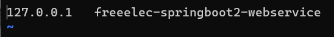

## 타임존 변경
서버의 타임존을 한국시간으로 변경합니다.

```shell
$ sudo rm /etc/localtime
$ sudo ln -s /usr/share/zoneinfo/Asia/Seoul /etc/localtime
$ date
```
- ln -s : 심볼릭 링크 생성 (바로가기)


## Hostname 변경
서버가 어느 서비스인지 표현하기 위해서 hostname을 변경합니다.

1. /etc/hosts 파일을 편집하여 localhost(127.0.0.1)에 대한 hostname을 설정합니다. 

```shell
$ sudo vim /etc/hosts
```



2. /etc/hostname 파일을 편집하여 /etc/hosts 파일에 설정한 hostname과 동일하게 편지하여 줍니다.

```shell
$ sudo vim /etc/hostname
```


3. 인스턴스 재부팅 후 hostname 변경 결과를 확인합니다.


