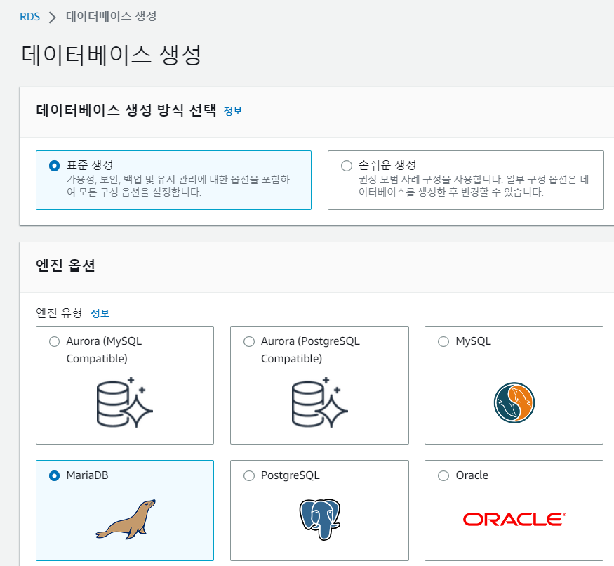
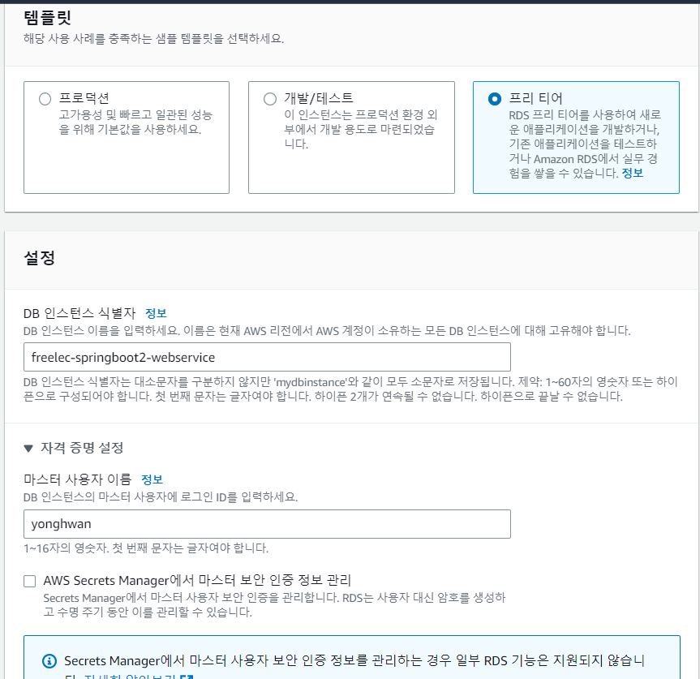
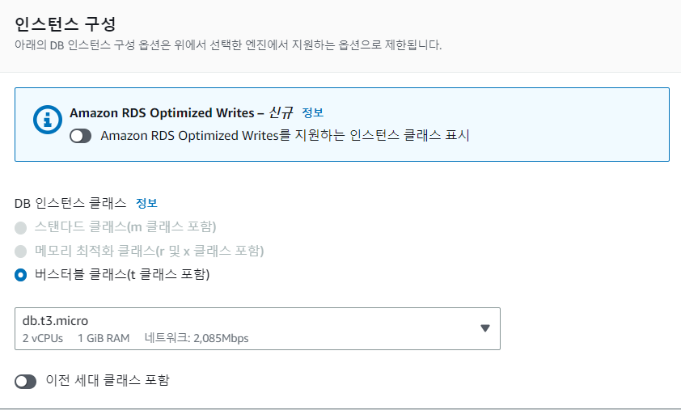
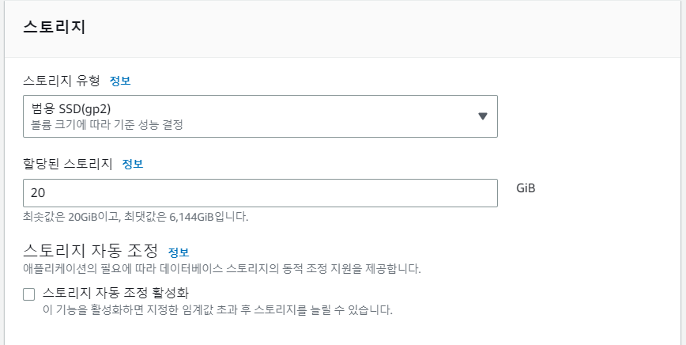
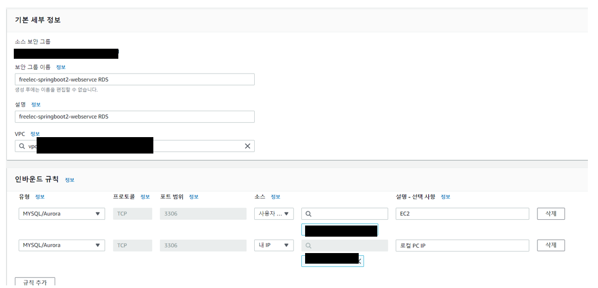
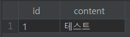

## RDS 인스턴스 생성

1. 데이터베이스 생성 방식 선택 및 엔진 옵션 선택

데이터베이스는 MariaDB로 선택합니다.



2. 템플릿 및 DB인스턴스 식별자, 사용자 이름, 암호를 설정합니다.



3. 인스턴스 구성에서 버스터블 클래스 db.t3.micro를 선택합니다.



4. 스토리지를 20GB로 선택합니다.



5. 퍼블릭 액세스를 "예"로 선택합니다.


6. 데이터베이스 이름을 설정합니다.


## RDS 파라미터 설정

- 타임존
- Character Set
- Max Connection

1. 파라미터 그룹 이동
2. 파라미터 그룹 생성
3. 파라미터 그룹 세부 정보 입력
    1. 파라미터 그룹 패밀리 : mariadb 10.6
    2. 그룹 이름 : freelec-springboot2-webservice
    3. 설명 : freelec-springboot2-webservice
4. freelec-springboot2-webservice 파라미터 그룹 편집
    1. time_zone : Asia/Seoul
    2. character_set : utf8mb4
        1. character_set_client
        2. character_set_connection
        3. character_set_database
        4. character_set_filesystem
        5. character_set_results
        6. character_set_server
    3. collation_connection : utf8mb4_general_ci
    4. collection_server : utf8mb4_general_ci
    5. max_connections : 60
5. freelec-springboot2-webservice 파라미터 그룹을 freelec-springboot2-webservice 데이터베이스에 연결합니다.
    1. 데이터베이스 선택
    2. 수정
    3. DB 파라미터 그룹을 freelect-springboot2-webservice로 선택

## 로컬 PC에서 RDS 인스턴스에 접속

로컬 PC에서 RDS로 접근하기 위해서 RDS의 보안 그룹에 본인 PC의 IP를 추가해야합니다.

1. 데이터베이스의 VPC 보안 그룹 선택
2. 새 보안 그룹 생성
3. RDS 보안 그룹 인바운드 수정



EC2의 보안 그룹을 선택하고 내 IP를 선택하면 자동으로 설정됩니다.

## Database 플러그인 설치

로컬에서 원격 데이터베이스에 접속시 GUI 클라이언트를 많이 사용합니다.

MSQYL 클라이언트 : Workbench, SQLyog(유료), Sequel Pro(맥 전용), DataGrip(유료), 인텔리제이 Database Navigator(무료)

1. 인텔리제이에서 Database Navigator 플러그인 설치
2. Database Broswer Action 선택
3. MySQL 선택(MariaDB는 MySQL 기반이기 때문)
4. RDS 접속 정보 등록


Host는 RDS의 엔드포인트를 복사하여 붙여넣습니다.

5. 신규 콘솔창을 열어서 데이터베이스 접속
```sql
use freelec_springboot2_webservice
```

6. 테이블 생성 및 한글 출력 테스트
```shell
CREATE TABLE test(
  id bigint(20) NOT NULL AUTO_INCREMENT,
  content varchar(255) DEFAULT NULL,
  PRIMARY KEY (id)
) ENGINE=InnoDB;
  
insert into test(content) values ('테스트');

select * from test;
```



## EC2에서 RDS에서 접근 확인
1. EC2 인스턴스에 연결
2. MYSQL 설치
```shell
$ sudo yum install mysql
```

3. RDS 접속
```shell
$ mysql -u yonghwan -p -h RDS 엔드포인트
```


